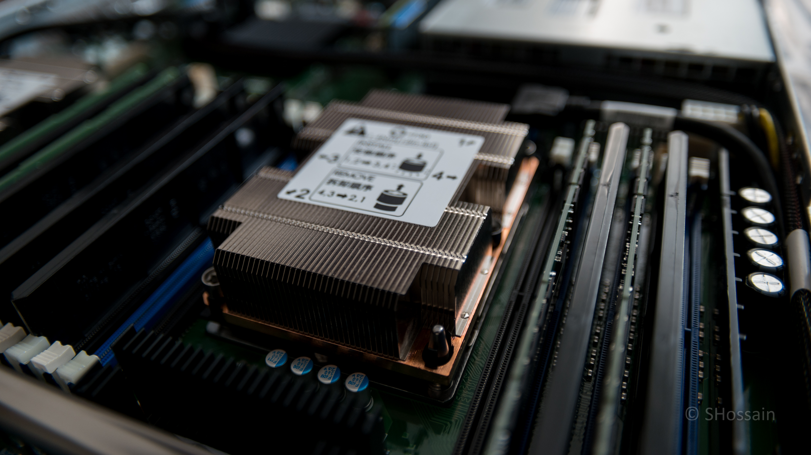

# Vote SHossain (alien) for NA region
## Vote Address: `RPzqobhiDPAh8uvRjkYVWUmcQUg6JbJuju`
### Why Vote SHossain?
- Reliable operations
- Fast to response and update
- High-end servers
- Experienced and dedicated operator
- Monitoring the network constantly
- Trusted team & community member
- Long-term Komodo fan
- Excellent track record ([check stats of alien_devA & alien_devE nodes](https://komodostats.com))

## Who is SHossain?
SHossain is currently Komodo's Chief Quality Officer and been testing all core-tech and end-user product with a good understanding of Komodo ecosystem since November 2017 while supporting users in need. He is with the community since BTCD mining days and participated in SuperNET ICO. He also wrote the initial BarterDEX API Summary and other dev and user centric guides. During the 2018-2019 election he brought in high-end dedicated servers and hosted them in world class Data Center and calls them **alien** nodes. Notary Nodes are very important part of Komodo ecosystem and SHossain intends to run his nodes reliably, which he has been doing since day one. His nodes achieved #1 and #2 in overall performance in 2018 season.

The alien nodes are also one of the first to response while adding a new coin or updating Komodo or iguana core. Also been running internal tests of new implementation, security closely with the dev team.

With the portion of mining proceeds, SHossain has been renting more dedicated servers to perform additional test of Komodo ecosystem, and helped in scaling test in the past and will do in the future. He is also running separate test dPoW network for development purposes using test chains.

Checkout current **alien** node specs below:

# EU

BTC pubkey - `020aab8308d4df375a846a9e3b1c7e99597b90497efa021d50bcf1bbba23246527`  
BTC - `1LMUVLvt6jAszL8ndKzbvnfsD3ZJWd45BS`  
KMD - `RUdfZrpAhYyT4LVz6Vyj2K14yK1uC2K4Dz`

## Server Spec
- Chassis:	Intel 1U Server System R1208WFTYS, 8x 2.5" Drive Bays
- Processor:	2x Intel Xeon Gold 5120 Processor - 14 Cores, 2.20GHz, 19.25MB Cache
- Memory:	4x 32GB 2400MHz Samsung DDR4 ECC Registered DIMM Module
- Storage: 2x 1TB Samsung 960 PRO NMVe M.2
- Power Supply: 2x 80 Plus Platinum 1100w, redundant PSU

# AR

BTC pubkey - `0348d9b1fc6acf81290405580f525ee49b4749ed4637b51a28b18caa26543b20f0`  
BTC - `131oDwcpSeFDuHckimj93WG6rVVyB8XVtr`  
KMD - `RBHzJTW73U3nyHyxBwiG92bJckxZowPY87`

## Server Spec
- Chassis:	Intel 1U Server System R1208WFTYS, 8x 2.5" Drive Bays
- Processor:	2x Intel Xeon Gold 6134 Processor - 8 Cores, 3.20GHz, 24.75MB Cache
- Memory:	4x 32GB 2400MHz Samsung DDR4 ECC Registered DIMM Module
- Storage: 2x 1TB Samsung 960 PRO NMVe M.2
- Power Supply: 2x 80 Plus Platinum 1100w, redundant PSU

### Thank you for reading and please send your vote to `RPzqobhiDPAh8uvRjkYVWUmcQUg6JbJuju` for a reliable operator in NA region.

# Contact details
Discord handle: @SHossain#0007  
[Komodo Discord](https://komodoplatform.com/discord)

