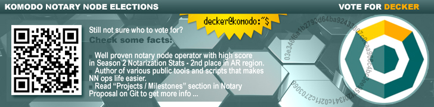

## BIO ##

Decker is a Komodo IT Expert and SysEngineer.

He joined the Komodo team in 2017 and handles a number of tasks relating to the Komodo infrastructure. Some of these include:

- Assisting core developers
- Providing Support for the Testing Team
- Developing new dapps
- Deploying fail-safe work environments (explorers, etc.)

He is one of the Komodo-Qt wallet devs - the world's first GUI wallet for a zero-knowledge fork that supports KMD and all its parallel chains. 

Decker has demonstrated knowledge and passion for blockchain, cryptography, programming languages and system administration. He is among the most active Komodo members. 

## Projects / Milestones ###

- [KomodoOcean](https://github.com/KomodoPlatform/KomodoOcean) (Komodo-Qt) [2018-2019] - completed development of the first native Qt wallet for Komodo and Zcash based fork. Last year we completed various wallet improvements, added sapling support into it, fixed minor issues and finally make komodo-qt available for all 3 OS (Windows, Linux and MacOS). Komodo-qt now is available on [https://komodoplatform.com/](https://komodoplatform.com/) in [Wallets](https://komodoplatform.com/komodo-wallets/) section.

- [SuperNET](https://github.com/jl777/SuperNET) / Iguana (Improvement of Iguana) [2018-2019] - added support of 2-bytes network prefix coins (like HUSH) in iguana, investigating and fixing various issues, marked as important by notary node operators, adding *sapling* support in dPOW and splitfunds and other related things. Here is a [full list](https://github.com/jl777/SuperNET/commits?author=DeckerSU) of Decker's contributions to iguana, merged into SuperNET repo branch, used by other notaries.

- [BarterDEX](https://github.com/KomodoPlatform/BarterDEX) / marketmaker (v1.0) [Feb 2019] - fixed a few sapling related issues (tx signing, withdraw method crash with many vouts) in BarterDEX marketmaker 1.0 to make current release work with sapling enabled chains.

- Notary Node Elections Management [2018] - provided technical assistant throughout all stages of the notary node Elections of 2018 (KMD blockchain snapshot creation, airdropping VOTE2018, statistical analysis, results checking, etc.) 

- [Z-NOMP fork](https://github.com/DeckerSU/z-nomp) [Dec 2018] - created a fork of Z-NOMP with support for KMD and sapling enabled assetchains. Recnetly we made few important bugs fixes like preventing the possibility of creating "fake shares" in some cases.

- [komodo-explorers-install](https://github.com/DeckerSU/komodo-explorers-install) [2018-2019] created and maintained a "one-click" explorer install repo for KMD and assetchains to help everyone deploy it quickly and without any issues. The latest iteration of Insight based Komodo explorers running using this repo.

- [CoinBin](https://github.com/DeckerSU/coinbin/tree/komodo) fork for Komodo [2018-2019] - created a fork of awesome OutCast3k's blockchain tools with KMD support. It's already integrated with official Komodo Explorer and allows you to create and sign transactions, addresses in KMD network using Javascript enabled browser only. The most important point was implementing sapling txes support, whichis now done and CoinBin can be used by everybody, for manual creating txes or in blockchain related things learning. Live version of Komodo's CoinBin is available [here](https://deckersu.github.io/coinbin/#home).

- [komodo_scripts](https://github.com/DeckerSU/komodo_scripts) [2018] - created a repo with various helper scripts for new notary node operators. This helped newcomers setup their notary nodes faster and decreased the learning curve to maintain the server. 

- [kmd-qt-wallet](https://github.com/DeckerSU/zec-qt-wallet/tree/komodo) [Jan 2019] -   created a fork of zec-qt-wallet adopted for using with KMD daemon (komodod). It's not a full-node itself, it's just a Qt GUI that interacts with komodo daemon (komodod) via RPC calls.

- [bip44-quick-gen](https://github.com/DeckerSU/bip44-quick-gen) [Nov 2018] - developed the helper tool to import addresses derived from BIP44 mnemonic to komodod or komodo-qt (can be used with Ledger seed, to import your addresses from Ledger Nano into komodo. 

- [WooCommerce-KMD](https://wordpress.org/plugins/komodo-for-woocommerce/) [Nov 2018] - participated in solving some issues during developent of WooCommerce-KMD plugin. 


## Season 2 Stats ##

- Visit [https://komodostats.com/](https://komodostats.com/) to get information about `0dev4_decker` Node Stats in Season 2.


## Hardware information ##

- Server #1 (Primary)

    | Spec     | Detail              |
    |----------|---------------------|
    | Platform | [SuperMicro SYS-1029P-WTRT](https://www.supermicro.com/products/system/1U/1029/SYS-1029P-WTRT.cfm) ([X11DDW-NT](https://www.supermicro.com/products/motherboard/Xeon/C620/X11DDW-NT.cfm))|
    | CPU      | 2 x [Intel Xeon Gold 5120](https://ark.intel.com/content/www/us/en/ark/products/120474/intel-xeon-gold-5120-processor-19-25m-cache-2-20-ghz.html) (**56 vCPUs**)|
    | RAM      | 4 x 32Gb DDR4 2400MHz Crucial ECC Reg (CT32G4RFD424A) |
    | Storage  | 2 x 1Tb SSD Intel P4500 Series (SSDPE2KX010T701) + Samsung 970 EVO [MZ-V7E500BW] |
    | Location | Tier III Level Data Center |

- Server #2 (Secondary)

    | Spec    | Detail              |
    |---------|---------------------|
    | Platform     | [Supermicro SuperServer 1028R-WTRT](https://www.supermicro.com/products/system/1u/1028/sys-1028r-wtrt.cfm)  ([X10DRW-iT](https://www.supermicro.com/products/motherboard/Xeon/C600/X10DRW-IT.cfm)) platform |
    | CPU     | 2 x [Intel Xeon E5-2620v4](https://ark.intel.com/en/products/92986/Intel-Xeon-Processor-E5-2620-v4-20M-Cache-2_10-GHz)  2S 8C16T CM8066002032201 (**32 vCPUs**) |
    | RAM     | 96 GB               |
    | Storage | 2 x [INTEL DC S4600 SSDSC2KG960G701](https://ark.intel.com/products/120518/Intel-SSD-DC-S4600-Series-960GB-2_5in-SATA-6Gbs-3D1-TLC)  960 Gb, 2.5", SATA III
    | Location |  Tier III Level Data Center|

Both servers uses RAID-1 (mirror) for fault tolerance, also, total storage space can be increased in case if we would have more 3rd party coins and assetchains on-board.

## Vote information ##

- [**AR**] Transparent: 
```
RDECKERmQJXWRN3n7o6gKy4vJrLqG16ufE
```
- [**AR**] Private: 
```
zs1kfk4qmu59w07l2ljd8lyvvfyhmms86zu0kzgpjlke02mlqsp4q499hnffqhu5c2dca9e56cn0y2
```


## Contact information ##

 - Komodo Discord: [Decker#3767](https://komodoplatform.com/discord)
 

