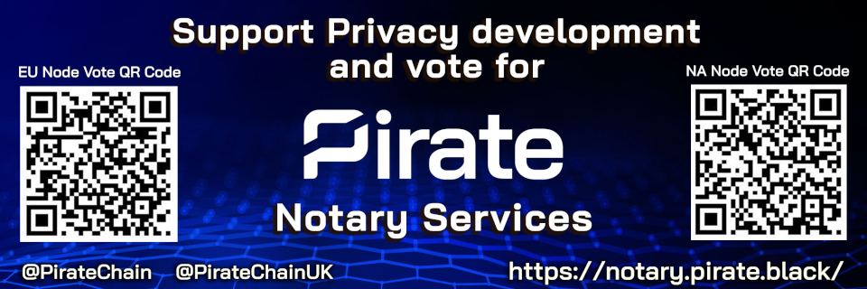

### [EU - Europe] ###

- VOTE address

```
RHs4FTLEYn7CcbLdRBNDbm6iNTUwxpj8ML
```

### [NA - North America] ###

- VOTE address

```
RTQZhmZn1YaBBGpKBxDy9aaHTipFCDCTUJ
```

### [AR - Asia-Russia] ###

- VOTE address

```
RC2pD9ietgA27QMhgv8nn5pFo2v7HfmesF
```


## Commitment ##

#### Our commitment is to the KMD Ecosystem and Pirate (ARRR) therefore almost all the reward will support that ####


#### For ALL interest blocks larger than 100 KMD: ####
* 50% of reward will go towards the Pirate Development fund
* 50% of reward will go towards the node operators

Disclaimer: Node server costs are in FIAT, therefore all distributions will be made after the costs are covered (300 KMD server cost is based on past 3 months KMD / USD rates)


### Server specs ###

- [EU]

	| Spec     | Detail		|
	|----------|--------------------|
	| CPU      |Intel  2x Xeon E5-2630v3 - 16c/32t - 2.4GHz / 3.2GHz	|
	| RAM      |128GB DDR4 ECC 1866 MHz				|
	| Storage  |SoftRaid 2x1.92 TB NVMe				|
    | Network  |1 Gbps up/down  |
	| Location |Datacenter - London, UK 			|

- [NA]

	| Spec     | Detail             |
	|----------|--------------------|
	| CPU      |Intel  2x Xeon E5-2630v3 - 16c/32t - 2.4GHz / 3.2GHz |
	| RAM      |128GB DDR4 ECC 1866 MHz			|
	| Storage  |SoftRaid 2x1.92 TB NVMe	|
    | Network  |1 Gbps up/down  |
	| Location |Datacenter - Beauharnois, Canada		|

- [AR]

	| Spec     | Detail             |
	|----------|--------------------|
	| CPU      |Intel  Xeon-D 1541 - 8c/16t - 2.1GHz / 2.7GHz |
	| RAM      |64GB DDR4 ECC 2133 MHz			|
	| Storage  |Hybrid SoftRaid 2x2 TB + 2x480 GB SSD	|
    | Network  |250 Mbps up/down  |
	| Location |Datacenter - Singapore		|


## Pirate Notary Crew ##

### Fishy Guts ###
```PirateChain Team role: Project management, Consultant, Community liaison, Zcommerce promoter, Onboarding```

- 1 year active Community Contributor in KMD Ecosystem - Ran many Community raffles to promote dICOs
- Provided the KMD Tip Bot and Wordpress Payment portal to the Community
- Commited [DigitalPrice.io](https://digitalprice.io) to add KMD as a base trading pair
- Working with radix42 to create a dedicated full node port of KMD to Nodl.it which will support all asset chains
- Pushed Z Address integration and adoption - something even JL777 was skeptical about
- 20+ years experience in Mortgage Finance and Sales including compliance and regulatory procedures

##### Contact Details #####

- Discord: [@FishyGuts#5085](https://pirate.black/discord)
- Twitter: [@PirateChain](https://twitter.com/PirateChain)
- E-mail: marketing@pirate.black
- Website: [https://notary.pirate.black](https://notary.pirate.black)

### Mr Lynch ###
```PirateChain Team role: Technical contact, Node operations & security, Zcommerce enabler```

- 18+ years ICT experience: system administration and security (red/blue team; mostly red)
- Early crypto miner (late 2010)
- Security Analyst by day, full time Pirate and KMD supporter
- Created the ARRR Sapling Bot which provides useful info to the Pirate Community
- Took part in early testing for Sapling migration
- Assisted the Community through the migration from Sprout to Sapling
- Early tester of Barterlly aka Tortuga
- PrivateBay pool operator

##### Contact Details #####

- Discord: [@mrlynch#5735](https://pirate.black/discord)
- Notary Website: [https://notary.privatebay.io](https://notary.privatebay.io)
- Github: [@mrmlynch](https://github.com/MrMLynch)
- E-mail: mrlynch@protonmail.ch
- Website: [https://notary.pirate.black](https://notary.pirate.black)
```
-----BEGIN PGP PUBLIC KEY BLOCK-----
Version: OpenPGP.js v4.4.10
Comment: https://openpgpjs.org

xsBNBFab35wBCACnJLjbJEPQdlabiT4h8XUwNXyIvHbErlnJ3KXP6UMX6aXG
ouy7UcHEYI0944H6V3jpMw1nk7gNCWCBgFQjPMtHJjhinWLiDo0gGafiKVyp
a9sGhAki2btxwPNgdodPa5Ar0iHEmCa7IyuW9QgalwmRVJcTnBKyieJSraku
T28qa50T6IE5sa/PdmB9ouVXfdGbUM43ZjlQQaPklobhFwjAyX3ZpkNVekOh
rEKA7L15oCFZXyyh8L9NyOVsLfPKIrD6jfT6O0jgdCt/GzrHjvqAXSco8R3r
VghnKmpWlkmM6AofKlQb+iLMX0DuVEokTWbhms27RfMqxoj+akgfIEGRABEB
AAHNLW1ybHluY2hAcHJvdG9ubWFpbC5jaCA8bXJseW5jaEBwcm90b25tYWls
LmNoPsLAfwQQAQgAKQUCWo8JuAYLCQcIAwIJEP/3hml7JluJBBUICgIDFgIB
AhkBAhsDAh4BAAoJEP/3hml7JluJjYEH/idER8y+y3h2hXr2hPpwSgnwQZNS
p+INiQWoghi5jMw7R28ppkBRa/p67ksEVjzVqpxl3DGZdcDTn0lok6BlwmLA
GlpYK3auWZuDXQlvaDdEHXNAOicy6R35XaQEnj6R+65tjCn0YxrtxsPHI4M6
niK/LwafeIhYc1rnwSWSR4YLGhDA6elTspyQC+IbtzqOAMnWdK2VrUSLuePm
R8gsSodYLgZ91Q1lYbXb5l/51VbWZxoq0kyYMP823IwD2UPRSLgobP1kdu61
bE5XgIAcVQKzY4aq0eV30WXCAtnMo0pvxOTFP7vOxUayGY0xtzskOqY05GPd
0SNRC8R0EeSVGJvOwE0EVpvfnAEIAKICqOTlPu6/7o0oKYvInmqSDyYMvosc
bW15kD+CB3Eqylrds+EzIz1an2WAvfpgXslhP4ccYfn1cymwrzImgbG5Z7q4
ssIb2/mu3IrlaUDMY7dKpEYs8eiP9Yj+Xa+no3NtIq39HWXaJ/nbxNNXehw7
nC12UZBvRPXvRFBB96JUJb8Np1SE0XUabFMeI+vzr8GmwRdTr3Cd2Kwvnt/p
tAstvdEtC/h+sXQKqb+gRaHHig+31oH8aQQd0+7vpF840LX4ShyDovKB9ZPJ
4EDtryT4zQm99I68DvvaRNuOQXYkf+sJUiBQojBCwlyXS/bSPkRkvynAciCp
94LbZeJm7j8AEQEAAcLAaQQYAQgAEwUCWo8JuQkQ//eGaXsmW4kCGwwACgkQ
//eGaXsmW4lihQf9G2XEAeHbuuLsajapxBZTpOHOSSnXno1h81+b5EAPTKJz
XVghOwrHRsiLUznw2dcI8TozVRrMt1QChxM7TPEZzyE/mkYgFZwk9JaAt8Zt
HeD5M+a0dq5lqZrC4VomOPgaAnp+CGD7ajMrXUh8ALfKvrtrV52AXr7rE7Ka
zcPxPw5o/CkP9v74C7pcvz+8G2+XevmGDQlUzWA30pk86755sfSEAmx6/4Ay
mQNk7qTm1CeBPgHqsk8lpcNiNAOYVqEaqXnr8Be9NBs6wyt/66XloII83EOR
Yz1g2h5NaiXYRvS8WR6gU/cfbzfHkIjso2TvYOsYrj9O6eLPTcvxFLBaiA==
=c4s6
-----END PGP PUBLIC KEY BLOCK-----
```


## Disclosure ##

- We are running for election for the first time
