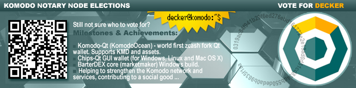

## Decker - Notary Node Candidate ##

- Business card: [https://deckersu.github.io/](https://deckersu.github.io/)
- BIO: Decker is a Komodo's IT Expert and SysEngineer. He joined the Komodo team in 2017 and handles a number of tasks relating to the Komodo infrastructure: helping core developers in various tasks, assisting the team in testing and developing new dapps, and deploying and supporting fail-safe work of various services, such as explorers, pools and others. Decker's most current project is creating Komodo-Qt, the world's first GUI wallet for a zero-knowledge fork that supports KMD and all its parallel chains. Decker is extremely knowledgeable and passionate about blockchain, cryptography, programming languages and system administration. He loves tasks that require a non-standard approach.
- PDF version of proposal: [decker_nn_candidate_en.pdf](https://deckersu.github.io/decker_nn_candidate_en.pdf)
- NN Server (Photo Gallery, 80 Mb): [https://deckersu.github.io/images/](https://deckersu.github.io/images/)
- Regions: **AR**, **EU**
- [VOTE address](https://vote2.explorer.supernet.org/address/RARcozaVAMZaXJaL6KWMSw297xTYzbDwa3): 

    RARcozaVAMZaXJaL6KWMSw297xTYzbDwa3
- zVOTE address: 

    zc9re8upRd4zZQ7Zs1qm1BnsXtEQ8yhQm3UeWkAugto5FwfgH6NoKTGqKM47K2QNus3CV5h3Kd3wUfzzjctZvj5S3EDFZqH

### Who am i? ###

I am an IT expert and systems engineer. I’ve formed part of the Komodo team since 2017. During which time I contributed to Komodo in the form of development towards the [KomodoQT](https://github.com/ip-gpu/KomodoOcean) (KomodoOcean) wallet - the **world's first GUI wallet** for a zero knowledge fork that supports KMD and all its parallel chains. Additionally I assist the team in testing and development of new dapps.

### Why Vote for Decker?  ###

In addition to the wallet development I took part in the creation of the first CHIPS wallet, building BarterDEXcore for Windows. Active member of the community with plans to support the platform in the long term. Notary node funds will increase my resources to improve Komodo dapps. 

### Proven Skills ###

- I can handle a wide spectrum of the Komodo infrastructure.
- Deployment and support fail-safe work of KMD and parallel chain explorers, hosted on my own servers and VDS.
- Software testing, software programming.
- Making blockchain snapshots, writing and translate documentations for users.

I’ve decided to become a candidate for the Asia and Russia / European region and I count on your support!

### Latest milestones & achievements ###

- https://github.com/ip-gpu/KomodoOcean - KomodoOcean (Komodo-Qt) wallet.
- https://github.com/DeckerSU/blockparser/tree/dev-decker - modified `znort987/blockparser` for KMD blockchain. Now it's also compatible with z-cash forks and results of this work will be used in KMD->VOTE snapshot during elections.
- https://github.com/DeckerSU/chips3/releases - Chips-Qt wallet release for Windows (32-bit, 64-bit), Ubuntu and MacOS. 
- https://github.com/DeckerSU/SuperNET/releases - marketmaker (BarterDEX Core) binaries for Windows, also some scripts for automate marketmaker build under Windows.   

### Notary Node (Server Configuration) ###

This hardware is **already** owned, small photo gallery and "unboxing event" is available [here](https://deckersu.github.io/images/). In case if i'm not elected it will be used for deployment several points of network infrastructure like Iquidus explorers for assetchains, ElectrumX servers and others. One of the main aims is helping to strengthen Komodo network and related services, regardless of the election results.  

- Supermicro [SuperServer 1028R-WTRT](https://www.supermicro.com/products/system/1u/1028/sys-1028r-wtrt.cfm) ([X10DRW-iT](https://www.supermicro.com/products/motherboard/Xeon/C600/X10DRW-IT.cfm)) platform
- 2 x [Intel Xeon E5-2620v4](https://ark.intel.com/en/products/92986/Intel-Xeon-Processor-E5-2620-v4-20M-Cache-2_10-GHz) 2S 8C16T 2.1-3.0GHz 20MB 85W 14nm FCLGA2011-3 [CM8066002032201](https://ark.intel.com/en/products/92986/Intel-Xeon-Processor-E5-2620-v4-20M-Cache-2_10-GHz) (32 threads summary) 
- 2 x 32Gb DIMM ECC Reg PC4-17000 CL15 2133MHz RAM
- 2 x 16Gb DIMM ECC Reg PC4-17000 CL15 2133MHz RAM (currently **96 Gb** of **RAM** total)  
- 2 x SSD [INTEL DC S4600 SSDSC2KG960G701](https://ark.intel.com/products/120518/Intel-SSD-DC-S4600-Series-960GB-2_5in-SATA-6Gbs-3D1-TLC) 960 Gb, 2.5", SATA III
- 2 x 2 Tb HDD (SSD and HDD - both in RAID)
- Location: Tier III Level Data Center (need enter into a contract for collocation, in case of victory in elections), Guaranteeing **99.982% availability**. 

Modern server equipment, placement NN in Tier III class data center and skilled tech NN owners - is a guarantee of Komodo Network stability. 

Let's do it together! Your vote can be decisive!

