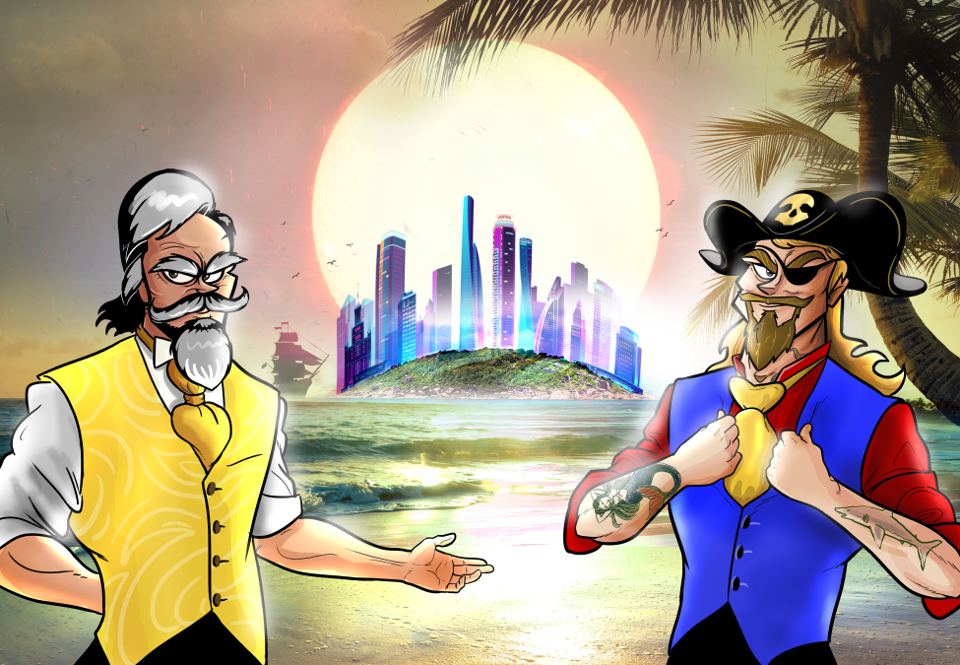
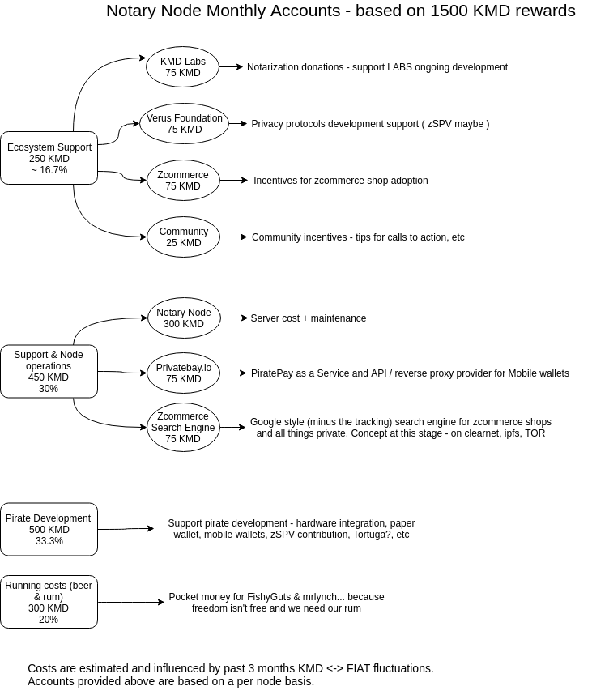

# Pirate - Notary Node Proposal #



## Who we are ##

### Fishy Guts ###

- 20+ years experience in finance + lending
- 1 year active community contributor in KMD ecosystem
- ```Team role: Project management, Consultant, Community liaison, Zcommerce promoter, Onboarding```

### Mr Lynch ###

- 18+ years ICT experience: system administration and security (red/blue team; mostly red)
- Early crypto miner (late 2010)
- Security Analyst by day, full time Pirate and KMD believer
- ```Team role: Technical contact, Node operations & security, Zcommerce enabler``` 

## Vote ##

### [EU - Europe] ###

- VOTE address

```
R....
```

### [SH - Southern Hemisphere] ###

- VOTE address

```
R.... 
```

## Commitment ##

#### Our commitment is to the KMD Ecosystem and Pirate (ARRR) therefore almost all the reward will support that ####




## Server specs ##

### [EU] ###

instert server specs here

### [SH] ###

insert server specs here


## Disclaimer ##

#### We are running for election on behalf of the Piratechain Project ####

#### Pirate Development funds may be redirected towards other ecosystem projects provided our projects share mutual technical goals ####

#### Percentages may be adjusted based on market fluctuations as server costs are in FIAT ####
i.e.:
- if KMD price goes up Support & Node operations % goes down
- if KMD price goes down Support & Node operations % goes up

- We ensure full transparency, on request, in this matter; Main goal is to keep the servers at peak performance
