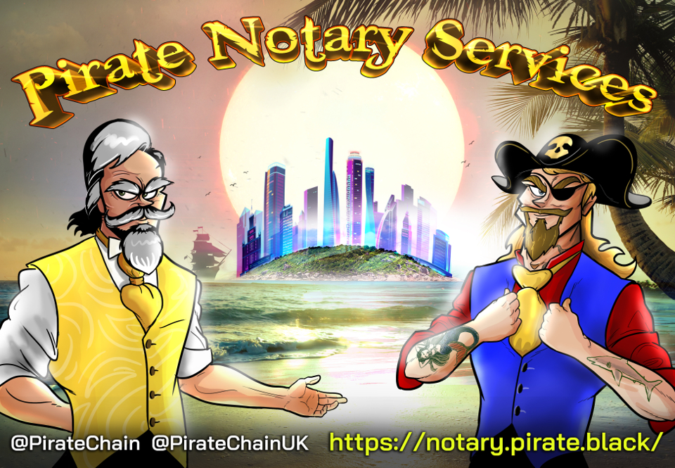

# Pirate - Notary Node Proposal #



## Who we are ##

### Fishy Guts ###
```PirateChain Team role: Project management, Consultant, Community liaison, Zcommerce promoter, Onboarding```

- 1 year active Community Contributor in KMD Ecosystem - Ran many Community raffles to promote dICOs
- Provided the KMD Tip Bot and Wordpress Payment portal to the Community
- Commited [DigitalPrice.io](https://digitalprice.io) to add KMD as a base trading pair
- Working with radix42 to create a dedicated full node port of KMD to Nodl.it which will support all asset chains
- Pushed Z Address integration and adoption - something even JL777 was skeptical about
- 20+ years experience in Mortgage Finance and Sales including compliance and regulatory procedures

### Mr Lynch ###
 ```PirateChain Team role: Technical contact, Node operations & security, Zcommerce enabler```

- 18+ years ICT experience: system administration and security (red/blue team; mostly red)
- Early crypto miner (late 2010)
- Security Analyst by day, full time Pirate and KMD supporter
- Created the ARRR Sapling Bot which provides useful info to the Pirate Community
- Took part in early testing for Sapling migration
- Assisted the Community through the migration from Sprout to Sapling
- Early tester of Barterlly aka Tortuga
- PrivateBay pool operator

## Vote ##

### [EU - Europe] ###

- VOTE address

```
RHs4FTLEYn7CcbLdRBNDbm6iNTUwxpj8ML
```

### [NA - North America] ###

- VOTE address

```
RTQZhmZn1YaBBGpKBxDy9aaHTipFCDCTUJ
```

## Commitment ##

#### Our commitment is to the KMD Ecosystem and Pirate (ARRR) therefore almost all the reward will support that ####


#### For ALL interest blocks bigger than 100 KMD: ####
* 50% of reward will be distributed to our voters based on the percentage their vote held.
* 30% of reward will go towards the Pirate Development fund
* 20% of reward will go towards the node operators

#### For ALL interest blocks smaller than 100 KMD: ####
* 50% of reward will go towards the Pirate Development fund
* 50% of reward will go towards the node operators

Disclaimer: Node server costs are in FIAT, therefore all distributions will be made after the costs are covered (300 KMD server cost is based on past 3 months KMD / USD rates)

## Server specs ##

- [EU]

	| Spec     | Detail             |
	|----------|--------------------|
	| CPU      |Intel  2x Xeon E5-2630v3 - 16c/32t - 2.4GHz / 3.2GHz	|
	| RAM      |128GB DDR4 ECC 1866 MHz				|
	| Storage  |SoftRaid 2x1.92 TB NVMe				|
    | Network  |1 Gbps up/down  |
	| Location |Datacenter - Frankfurt, Germany			|

- [NA]

	| Spec     | Detail             |
	|----------|--------------------|
	| CPU      |Intel  2x Xeon E5-2630v3 - 16c/32t - 2.4GHz / 3.2GHz|
	| RAM      |128GB DDR4 ECC 1866 MHz			|
	| Storage  |SoftRaid 2x1.92 TB NVMe	|
    | Network  |1 Gbps up/down  |
	| Location |Datacenter - Beauharnois, Canada		|


## Disclaimer ##

#### We are running for election on behalf of the Piratechain Project ####

#### Pirate Development funds may be redirected towards other ecosystem projects provided our projects share mutual technical goals ####

#### Percentages may be adjusted based on market fluctuations as server costs are in FIAT ####
i.e.:
- if KMD price goes up Support & Node operations % goes down
- if KMD price goes down Support & Node operations % goes up

- We ensure full transparency, on request, in this matter; Main goal is to keep the servers at peak performance
