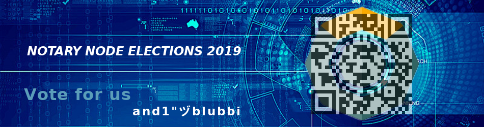
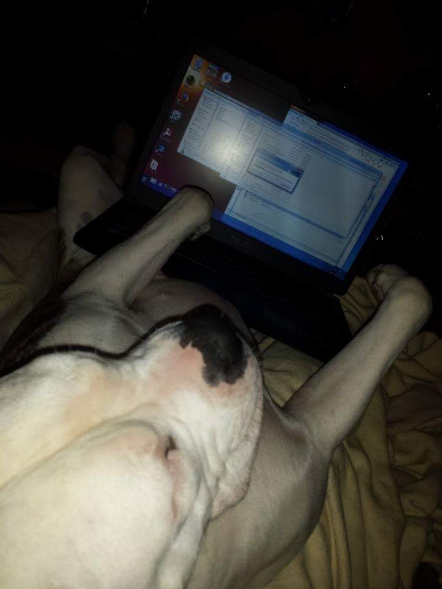

# **Notary Node Proposal and1-89**





<p align="center">
  

-----
-----

# KMD EU : RB1BSgGjcNM1tJt7XG6CWqJ9kyWHuitRX7 

----
----


# How to vote ##

**1.** Download Agama - https://komodoplatform.com/komodo-wallets/

**2.** Import your KMD private key or seed and start KMD coin

**3.** Activate Coins --> VOTE2019 Coin--> select

(VoteCoin2019 will be airdropped 14. April equal to your Agama KMD amount)

**4.** Send your VOTE2019 Coins to one of the addresses listed


```
Note: Only first transaction of VOTE2019 Coin will be counted as a valid vote.
If you have multiple KMD addresses don't consolidate before sending your VOTE.
```

# What is a Notary Node?

*Excerpts from the original documentation*

https://blog.komodoplatform.com/delayed-proof-of-work-explained-9a74250dbb86

* 64 special nodes which can create a network of its own dPoW (delayed Proof of Work) peer-to-peer network and communicate with each other exchanging the latest blocks and dPoW consensus information related to the blockchains it is securing. The nodes in this dPoW peer-to-peer network are called Notary Nodes (NN).
* Since dPoW was first created, there have been 4 Notary Nodes reserved for Komodo’s developers.
* The other 60 Notary Nodes are elected based on the votes of KMD holders and how they vote for the Notary Node operators.
* The Notary Nodes votes are every year, the top 30 Notary Nodes that completed the most notarizations (of Komodo to Bitcoin or Assetchains to Komodo) are automatically re-elected for another year. This gives notary node operators incentive to do their job well, rewards diligent operators, and ensures a smooth transition from one cohort to the next.
* The lowest 30 Notary Nodes positions are opened every year to the community.
* The location of Notary Node servers must be diversified on all continents. The regions are categorized in the following locations: Southern-Hemisphere (SH), Asia-Rusia (AR), North-America (NA), Europe (EU).
You find the full explanation about how delayed Proof of Work (dPoW) and Notary Nodes (NN) work in the link above.


# Reasons to vote for us:


##  First of all Who We are ? 

We’re  Technic and Crypto enthusiast from Germany, who has already collected experience by running an KMDLabs StakedNotary, XMPP Chat Server and handling 
our own Mining Farm. Also some of you knowing us as one of the Admin’s in the 
Komodo and Pirate Channel of Germany’s Telegram Group.

* We are convinced that the potential of crypto lies in it’s decentralisation. It means specifically (for us) that 64 nodes should be distributed among 64 different node operators.

* Since the Komodo team is focused on developing the technical applications of  Blockchain, we are convinced that this will have an enormous impact on the entire future Blockchain technology. That's why we want to bring in our personal experience to the community.

* We are not official team members or partners of Komodo. We see independence as an additional contribution to decentralisation.


## Server Information:


**CPU:**          IIntel Xeon E5-1660v3 - 8c/16t - 3/3.5 GHz

**RAM:**          128GB DDR4 ECC 2133 MHz

**SSD:**          SoftRaid 2x1.92TB NVMe

**Networking:**   1000 Mbit/s upload bandwidth

**Location:**     Frankfurt, Germany


----

**KMD EU Vote address:**```RB1BSgGjcNM1tJt7XG6CWqJ9kyWHuitRX7```

----


Discord: [And1_89#6578](https://komodoplatform.com/discord)
