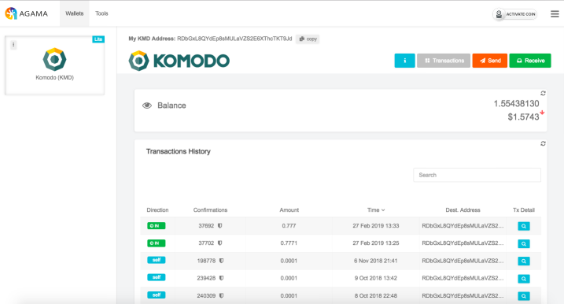
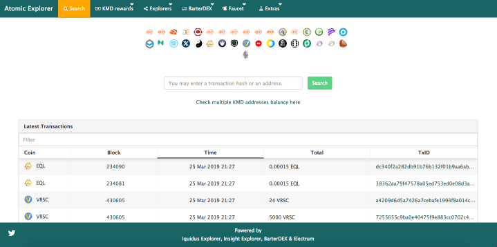
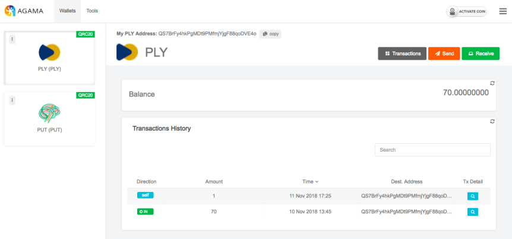

# pbca26 Notary Node Proposal 2019

## Voting Address
Region: **AR**

```
RNH8AGcxMadyQFfGepTn7jQWFEU6v5zJ7m
```

<br/>

## About Me
I am an experienced full-stack JavaScript developer and blockchain enthusiast. Web development always has been my driving force and passion. I have worked on various projects before I joined Komodo Platform in 2016. Since then I was highly involved in SuperNET community and became a dedicated team member.

Together with Satinder Grewal and ca333 we laid the first stone to what later became Agama desktop wallet. In late 2017 I created Agama mobile wallet – the first mobile wallet to implement KMD rewards claiming feature, and AtomicExplorer.com an asset chain explorer. 

Today I am proud that many community members are using Agama to hodl their crypto assets. Moreover, various emerging projects such as Chameleon, Verus and Pungo are building their wallets based on my work.

## Contact Details
Discord - pbca26#5430

Github - https://github.com/pbca26

## Projects
### [Agama desktop](https://github.com/komodoPlatform/Agama)
Co-developed multicurrency crypto wallet which combines two modes together native (full node) and SPV (lite mode). Rooted in NXT project Agama served as an inspiration for ZelCore wallet that also supports native and lite modes, and as a code base for VerusCoin wallet. Now Agama desktop supports 30 blockchains, 45 KMD asset chains and hundreds of ERC20 tokens.

<p align="center">
  
</p>

### [Agama mobile](https://github.com/pbca26/agama-mobile)
Developed the first KMD rewards claim capable and dPoW enabled mobile wallet which is also the first wallet to support various KMD asset chains along with dozens of blockchains as well as Ethereum and ERC20 tokens. Several projects adopted certain parts of Agama mobile code. Chameleon wallet and Verus Mobile to name a few.

<p align="center">
  
</p>

### [AtomicExplorer](https://atomicexplorer.com)
Developed a unique Komodo asset chain explorer that allows to check balances and transactions for an address or overview transactions across KMD asset chains. Among other features, AtomicExplorer has a standalone web wallet and KMD rewards calculator where you can see projected rewards breakdown for a specific period of time.

<p align="center">
  
</p>

### [Enhanced Komodo Paper Wallet](https://github.com/KomodoPlatform/KomodoPaperWalletGenerator)
Upgraded a fork of WalletGenerator.net paper wallet that combines useful tools to extract private keys from bip39/agama/barterdex seeds, and generate agama/barterdex compatible seeds etc. Komodo paper wallet's code is also used in [Chainzilla's revamped paper wallet version](https://chainzilla.github.io/kmd-paper-wallet).

## Community work
I created a special version of Agama desktop wallet that has a support for QRC20 tokens. Pitched to Qtum community by PTYX at the end of 2018. An idea was to onboard more projects to use Agama desktop and mobile which would place our wallet among a few that support QRC20 tokens.

<p align="center">
  
</p>

## Reward Update 
As was stated in my last year election proposal I would gladly spare some amount of minded funds for rewarding purposes. 

I really appreciate initiative people who care about the community as I am and made significant contribution towards development. As a token of my gratitude, I would like to thank and reward a few people for their input.

**Decker** who has made a lot of bug fixes and improvements to komodod and Iguana core which significantly helped notary network stability. He is developing and supporting Komodo QT wallet.

**[Reward - 350 KMD](https://www.kmdexplorer.io/tx/de101746774143f45fdc3fa31d79af18fedb038f86be6bdb3c434bcb3e08ae31)**

**Luke Childs** for finding and disclosing various security vulnerabilities in closed source and open source projects including BarterDEX and Agama.

**[Reward - 250 KMD](https://www.kmdexplorer.io/tx/27a2143ca3814a9158d015684056c73ab454ef71d2bb410bc4c807af141778ec)**

**Webworker01** for spending a lot of time to create such a useful website komodostats.com where anyone can see notary node statistics.

**[Reward - 200 KMD](https://www.kmdexplorer.io/tx/4a11439473288e63307fbb59003c201f33d57f599ccc3a15cd5a9f84daed7051)**

Hopefully, KMD value continues to grow and next year more initiative developers will get a gratuity. 

## Why you should vote for me?
For season 3, I would like to put myself forward as a candidate to run for a node in AR region.

As a result of my consistent work throughout a year my NA node will be automatically re-elected. I have proved myself being a dedicated and reliable notary node operator.

Having a secondary node brings me an opportunity to dedicate more time helping and contributing to various community projects, expand AtomicExplorer in a way that is more scalable and user friendly, focus on hardware wallets integration e.g. Ledger and Trezor, and advanced multi-signature support.

## Voting Address 
**Region:** AR

```
RNH8AGcxMadyQFfGepTn7jQWFEU6v5zJ7m
```

VOTE2019 airdrop is scheduled on April 14th. Tokens will be distributed among all KMD holders in ratio 1:1. To cast a vote you need to send your VOTE2019 tokens to notary candidate address of your choice.

Thank you for your vote and support!

---

### NA Server specifications
- 2 x Intel Xeon E5-2620v4
- 128 GB RAM
- 4 x 480GB SSD (RAID 10)
- 1 Gbps port
- Location: NY, USA
- KMD-address: REX8jNcUki4NyNde3ovr5ZgjwnCyRZYczv
- BTC-address: 16EwerjC9tFouNGSadwiz3MYBWkNk7Bb5A
- btcpubkey: 0276aca53a058556c485bbb60bdc54b600efe402a8b97f0341a7c04803ce204cb5

### Disclosure
I am a part of the Komodo team