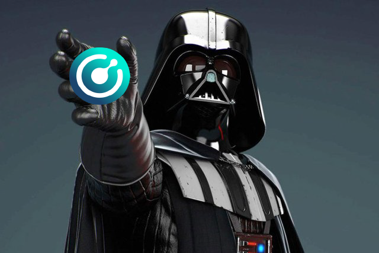

<p align="center">
  
</p>

## Voting Info ##
Region: **SH**

Address:
```
RCtyCsJVo6VKmEFmHL9hzoXLtKeoYeZUmK
```

## About me ##
- I like to code in my free time and buidl things
- Bachelor degree in Computer Networking
- Currently I work at a digital agency and provide servers maintenance and support for clients
- Huge fan of Star Wars franchise

First time I learned about Bitcoin was late 2013 from one of my college friends. Started mining on Radeon GPU a few weeks after that and made my first Bitcoin within a month. Since then I became absolutely facinated by blockchain technology and its use cases. Learned about Komodo a year ago. Really like that the platform is developer oriented and highly active on Github. I think it has bright future and can become a major player in the following years. In my spare time I also like to fiddle with eletronics mostly repair and bring back to life old phones, cameras, tv, laptops etc.

## Mined funds will be used to ##
- Cover hardware costs
- Dedicate time to buidl dapps on Komodo
- Support ecosystem projects where applicable

## Pledges ##

**`10%` quarterly KMD airdrop to voters that support me.**

## Server specs ##
- CPU: AMD Ryzen Threadripper 2950X
- RAM: DDR4 128GB
- Storage: NVME 2TB x 2
- Network connection: 2 Gbit

## Contact info ##
**Discord:** Dapp Vader#4565

**Keybase:** https://keybase.io/dappvader

## Disclosure ##
- I am not a member of Komodo Platform team
- I am running in Notary Elections for the first time

<p align="center">
  
</p>