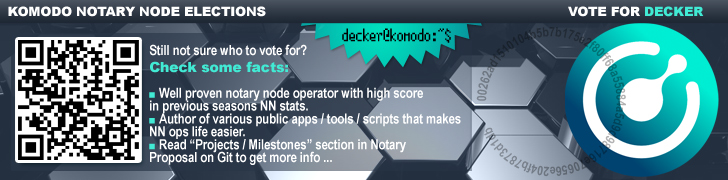

## BIO ##



Decker is a Komodo IT Expert and SysEngineer.

He joined the Komodo team in 2017 and handles a number of tasks relating to the Komodo infrastructure. Some of these include:

- Assisting core developers
- Providing Support for the Testing Team
- Developing new dapps
- Deploying fail-safe work environments (explorers, etc.)

He is one of the Komodo-Qt wallet devs - the world's first GUI wallet for a zero-knowledge fork that supports KMD and all its smart chains. 

Decker has demonstrated knowledge and passion for blockchain, cryptography, programming languages and system administration. He is among the most active Komodo members. 

## Projects / Milestones (2019-2020) ###

- [KomodoOcean](https://github.com/DeckerSU/KomodoOcean) (Komodo-Qt) [2019-2020] - maintained native Qt wallet for KMD and smartchains among whole year: successfully implemented changes needed for HF (Obsidian Dragon) transition, added new features, deleted old / unused code (code refactoring), improved exising features (such as wallet filter and others), fixed CVEs, etc. At the begin of Feb/2020 Komodo-Qt had over **14k** total downloads and this is a great achievement itself.

- [yiimp-stratum-equihash](https://github.com/DeckerSU/yiimp-stratum-equihash) - created world first public implementation of equihash stratum for well-known Yiimp pool. Also, distinctive feature of this implementation is so called "local mode", which allows stratum binary to work without Yiimp MySQL database. In "local mode" it acts like simple proxy, between miners (equihash stratum protocol) and daemon's `getblocktemplate` and can be used not only with KMD or any other equihash based coin, but also with any other coin daemon supported by Yiimp Stratum in original. Also, project included a special branch for MSVC building, so, it can be used in "local mode" even by Windows users.

- [komodo](https://github.com/KomodoPlatform/komodo) and [vrsc](https://veruscoin.io/) - contributed with various fixes and improovements, which allowed komodo and verus daemon to be more stable, secured and convienment to use. Assisted other developers in mitigating of few attack vectors, discovered during 2019 year. 

## Projects / Milestones (2018-2019) ###

- [KomodoOcean](https://github.com/KomodoPlatform/KomodoOcean) (Komodo-Qt) [2018-2019] - completed development of the first native Qt wallet for Komodo and Zcash based fork. Last year we completed various wallet improvements, added sapling support into it, fixed minor issues and finally make komodo-qt available for all 3 OS (Windows, Linux and MacOS). Komodo-qt now is available on [https://komodoplatform.com/](https://komodoplatform.com/) in [Wallets](https://komodoplatform.com/komodo-wallets/) section.

- [SuperNET](https://github.com/jl777/SuperNET) / Iguana (Improvement of Iguana) [2018-2019] - added support of 2-bytes network prefix coins (like HUSH) in iguana, investigating and fixing various issues, marked as important by notary node operators, adding *sapling* support in dPOW and splitfunds and other related things. Here is a [full list](https://github.com/jl777/SuperNET/commits?author=DeckerSU) of Decker's contributions to iguana, merged into SuperNET repo branch, used by other notaries.

- [BarterDEX](https://github.com/KomodoPlatform/BarterDEX) / marketmaker (v1.0) [Feb 2019] - fixed a few sapling related issues (tx signing, withdraw method crash with many vouts) in BarterDEX marketmaker 1.0 to make current release work with sapling enabled chains.

- Notary Node Elections Management [2018] - provided technical assistant throughout all stages of the notary node Elections of 2018 (KMD blockchain snapshot creation, airdropping VOTE2018, statistical analysis, results checking, etc.) 

- [Z-NOMP fork](https://github.com/DeckerSU/z-nomp) [Dec 2018] - created a fork of Z-NOMP with support for KMD and sapling enabled assetchains. Recnetly we made few important bugs fixes like preventing the possibility of creating "fake shares" in some cases.

- [komodo-explorers-install](https://github.com/DeckerSU/komodo-explorers-install) [2018-2019] created and maintained a "one-click" explorer install repo for KMD and assetchains to help everyone deploy it quickly and without any issues. The latest iteration of Insight based Komodo explorers running using this repo.

- [CoinBin](https://github.com/DeckerSU/coinbin/tree/komodo) fork for Komodo [2018-2019] - created a fork of awesome OutCast3k's blockchain tools with KMD support. It's already integrated with official Komodo Explorer and allows you to create and sign transactions, addresses in KMD network using Javascript enabled browser only. The most important point was implementing sapling txes support, whichis now done and CoinBin can be used by everybody, for manual creating txes or in blockchain related things learning. Live version of Komodo's CoinBin is available [here](https://deckersu.github.io/coinbin/#home).

- [komodo_scripts](https://github.com/DeckerSU/komodo_scripts) [2018] - created a repo with various helper scripts for new notary node operators. This helped newcomers setup their notary nodes faster and decreased the learning curve to maintain the server. 

- [kmd-qt-wallet](https://github.com/DeckerSU/zec-qt-wallet/tree/komodo) [Jan 2019] -   created a fork of zec-qt-wallet adopted for using with KMD daemon (komodod). It's not a full-node itself, it's just a Qt GUI that interacts with komodo daemon (komodod) via RPC calls.

- [bip44-quick-gen](https://github.com/DeckerSU/bip44-quick-gen) [Nov 2018] - developed the helper tool to import addresses derived from BIP44 mnemonic to komodod or komodo-qt (can be used with Ledger seed, to import your addresses from Ledger Nano into komodo. 

- [WooCommerce-KMD](https://wordpress.org/plugins/komodo-for-woocommerce/) [Nov 2018] - participated in solving some issues during developent of WooCommerce-KMD plugin. 

## Vote information ##

| VOTE2020 Address                   | Pubkey                                                             | Region |
| :--------------------------------- |:------------------------------------------------------------------:| :----: |
| `RHTDBTqeMyoEEdRZWWXfL6TZzF7LAi8jNd` | `0262ad1510104b5b7b175e2f80ff68a55884a5d9d98716e70656e204fb7873d1db` | **EU**     |

## Season 4 Info ##

|                         | Pubkey                                                             | KMD address                          | BTC address                          |
| :---------------------- |:------------------------------------------------------------------:| :----------------------------------: |:-----------------------------------: |
| decker_EU (mainnet) | `03777777caebce56e17ca3aae4e16374335b156f1dd62ee3c7f8799c6b885f5560` | RS4S9b9aG1yfeXFoBj2NcPoBE21XKfJDgc | 1HnF55GHfCB6aWtbiZ3FWsTyTkYvf9QQpJ |
| decker_EU (3p)      | `027777775b89ff548c3be54fb0c9455437d87f38bfce83bdef113899881b219c9e` | RT7FV7XBPrJXuuTCYK8HsfZEg5a5X2Qzzi | 1Jq4Qbdto2Vxqu61599An9E2up7Uumci3E |


## Contact information ##

 - Komodo Discord: [Decker#3767](https://komodoplatform.com/discord)
 - E-Mail: deckersu@protonmail.com
 - KeyBase: [https://keybase.io/deckersu](https://keybase.io/deckersu)
```
-----BEGIN PGP PUBLIC KEY BLOCK-----
Version: GnuPG v2

mQINBF4AUywBEADPxAHpwvWwIl07Mowl9oeGbIVDieosEXMR4dNdt5PfvOdqbBSE
JDbKuDelutiBPO5MCNpCaIGqQxHjB+jUPeiBLbfd3hUf5vSTc6CF6x9AGMqSUtfE
YJ7+6Bzy2cUIM2jioK4umyzYoA6NfJLbEFpjl4xb3iF5UCcEAXSy0bIPu91Hjnvj
bw+RYpObKuXby/nh7cnqIq0ZejFkm4dPzUz/5H/7kWiz2lgdtI0+qicuCUTed+Bp
lL7VQqtBKKAdE07Z4C3IKTec1cXFEE/G/zQxfIOHOCK1LwGynPiFgu4Tuq9LZYOi
wDXTmk4k3fqGw50A0MYSoEnBy9S8XpUwJh11kOVxoYGuby3MKz4d9RAONPQ7zvlh
CkhmPG74JR7j2ihK2wRwQCSkCrvqhQ9Qv7yAyhTR9ekwuSLhf0+tIDUfAfAsHA73
pCPnE0PuViCSnBgTJiFGlI/Gl+KFkQPEek4KHJufoWTPddORRbm5nifchp6GtD/r
LHMpi6GGN5uDDgdiGp51ZMngAzr0KWRpo/x8V8faTSJFmCePIkpJnHaoCoeOxasd
jymuJ9nnM20rinRHW+/9ifocjOZVdk6H4YscsDdFVqPZMefx08Bdgr4KWuzkjiX3
Lym6z/4vkod6uFXPvLZNsOshj1cx+Xgd8MCaW/oqcn/XpxwrNqg6jwykRQARAQAB
tCJEZWNrZXJTVSA8ZGVja2Vyc3VAcHJvdG9ubWFpbC5jb20+iQI3BBMBCAAhBQJe
AFUhAhsDBQsJCAcCBhUICQoLAgQWAgMBAh4BAheAAAoJEP5QSAhi5kUc5zEQALlE
tTpmrL1oSxdGusF/cvbSGyCQ9WJoinq4zSWNrZWNstC4F5YdoAsZQD2CUzA625OP
P4A6AG9iTt9D1jH5WTBAUiEuetOB/xrjsC66xEjf+Xk3XwDq2iTEz6xvRhVu1b+3
ZaxJ7alBSdZM6HCnW0aVuyMu2zDZ9E4oZJfkKes4E24K0SRo2siRhYPMzgRnA+nS
wcCm0G/q3i4x3PT9knT+j2xwpMVcVbUHgNaRj0SUFBDItFSb8NYHj7dgzlfwxYjQ
BOEut5qi+3WH+gVCAGjMUqorll6UroF6kr13309MRMeZJEzEV/GkK521V5JU2ckY
+nY4ggDM4TnspQmRRmsD/C66+mlGGXgrQ3bBhELX20r1CmP3HDv2c4zp2HL3psdp
weRV+Ini+mv4MbZqjqAHHa8cxYSIwsG+tsfBqNv+zk7UsR7KhRyEF+u4hs3Kus9b
5sFUxdGKDEeq+CQXahzpG6ii9IyGOm03/fBoDBxVBGk4wn/frHdLpoOjx2Pa/Bx9
+7qRKjdDPY0TPmBG4oPCiypwSzFFFuVRwhsCOF8D62FUUfDKNoaLHmDXCO2WpqHl
7ADHxma0x/itlzXoO+K77AWsgLVj3iRfhHvsIL8cWMMZkjrvx11CdOtaQy2NfhSd
QeQgkH1fObCW0OqdoKyFfiyPIFXxnXhxUHlGwtyxtBxEZWNrZXJTVSA8c3VwcG9y
dEBkZWNrZXIuc3U+iQI6BBMBCAAkAhsDBQsJCAcCBhUICQoLAgQWAgMBAh4BAheA
BQJeAFUnAhkBAAoJEP5QSAhi5kUcQFgP/3ey4DYZ/R+/RDdIsolAi2m/7ClJnZ1m
Q92a6Qq6WqaAUi+cs5/ZC6CNjLue7lx8zea13iEMbQZGYAwpF08esmDj+kPQiNjD
gyUrf/ZEP4A+QW4FmBKTfY2PFZ1TfoqdcyKwZOAR4zzulapRGv9tnKEwaBz+8q7e
Us1Rx20vF9e1Y9KqMgtKUYXVwJCtiRZ/SMB8Zf5ZPtKMu6ZmC0mEUTaoF6RazUVE
erO3LPlmOgxEnfPkPw/5nUb8h5g5jnOy+3kSWOGIN1TW9XuDLXdfzR4qhyMZPbBj
wf9EYChBp7RZNeC0lFwfSBHMDeZaAXZCXBV8tuvadXhDo8KRDk27Jop3G4+8ybgi
16EO0NKuyPl6gU3m0v5oDEO7u1BUi75IpIdTZyR4oCBxRm39WK8DMkzgWlt5S7XM
p59DEKdoef3VYDw6u0feRmLFzfNXUFvaTgyUEsJleqJof+uvVjsjqY702MLOZbyb
+j1AU6E1NyJaAjaHiIWxKYsxvQ7zaMWUd1WvHOznGUJCJOExULc5+AD3REfD2P8h
pYTtLpLW7YK32PcCxULZqrl0PDal6xKkyVOcA/VApcIgFy+y6Ufn8a8zi87hUoyK
oztyNDFGwVfzVSBTmnlAlryg6PmDc3uY+IvNgU5xz3stwSBLIAM5iednbiSulEwW
xlreyUYUVtBeuQINBF4AUywBEAC/3OSP2XQZU+ywHwBl9wFJaPU+fkOUG6ThDsK2
RX8eNgGIYQUB9dvshBXHE1Y5gCWCfZUkbwzR/YWoGX4TQegxLG/I01fawUsr+SN9
FJWFXHio1ZOcYvdUbQOjTwzTlQWZ9vo1MsFZ9PXBi7J/pHAOrGsBH0VwueJuAvpJ
dPWwMUhSOkbr0ikaW4IAsIhsqzuTCu5oy2TeIFC1YZKjsU1MyPtEM6kHreaeuHo0
cDY7yYLwJ2fXlBeI/ER6bDlkQSnRMKC1bgeLbuaNHUDTGKp1DvcxE4QTuQlhuLab
Ewcq44oz5onvaSBHaQ7XVoXGjja3Er72lqx2r+yzS5hHt8Rm5gs8z/RNEhMjKUsu
AnhVjU9+GPKUWHBhURwJYCslOW8B4rELUuieYjVNkY5fKHHqViGa1fmbNpWWT0qJ
HkwFSX8e5i33L0NVT7XZCSxQ7OG8A8JgL0oU2fkqSR3BwJCTtccVUHnQM1p3vFfe
S1yjw8i5f3D1bUviyUqQGPfExGtHznpGe5rhDlwdKTM82SoBlywMnYatid42qW1x
eEkFYI1Ma46pylIGsZYXo1953qqDYycv5q7YYcvwK+l1dLx+wxCDa68yYA61Gr8U
wUYZE0qFXwffkWtd/okZX78UL22MxmekdILAnjyGbFQQqEvuRfmflhNWu+LEKpgl
/33MZQARAQABiQIfBBgBCAAJBQJeAFMsAhsMAAoJEP5QSAhi5kUcT1wP/2Rx66TC
VIFyJD9aVnIlTlM1qXpMeOI1bkNbnqUNpCn1vLPw2c6U+SF/Wd3B/2vFWDWBcd2m
y7wDtgDWmOvje4bP/aYVMt3AvUEJD+nZo4nJjmvJ+U9cIneGc4sZb5wHH0fZOicf
+/M90OVXrJ/35gvc92v8iFv7sQt3yRAN62frfw163WOTqWIWY1VCujVZPda5B+Sh
wnq/Xo2hrDbl+0zjI1JH1OW4z5Pl+Fq7pgVQROgnGFoJ0qQeapJ4n4LXU82WrPgO
5ltolJj3lpZLWe6YHm8eB/+7GEn0SzEOk12pF98DmR7/Op2S1yVIkLRVbPn8fVID
+SQ8cWO8MrNzp/RSQ0En5CnO4gFk2+QHSJlqjL/rMyT3Re6ujyB4J8IblCgeuzEL
o6WB2BRgokW5UsgVgKHVcucCSFnjE9kX6Bkd6p8Uf9yW/vZ5bV7ljRNRxZODs6/5
i1p6be8RdZUM/dhzwL2QB3C/fKeD09l8w4vIk4f0T+w/aKnHH3M8lFToEa9Cz/Da
yxgG3wuYygshkeNSoYw9kArEbjwPRsEA558cKVOmqMkpGRR3MsHrAouOyEvV+jhP
Y/bUCJ5M28Aulcdl3gW0cRdvRXhDVXQ6jEf6FMTZI0OEZfFUpWq4Cbvu+HRDJ5BF
IIyLyBKVZC5++P2IYLuNGNT+aJX5k3pwtXqt
=T2a+
-----END PGP PUBLIC KEY BLOCK-----
```
 

