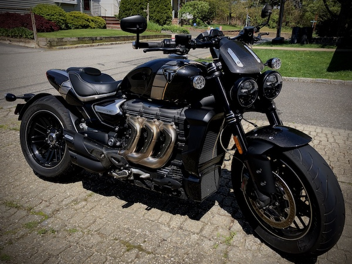

# 2020 Komodo Notary Node Elections.  Season 4

## About Me  
For Season 3, I volunteered to be the operator for Voskcoin's Notary Nodes in part so that I could brush up on my previous Linux experience, but more because I wanted to learn about Komodo.  
This past year, I've learned a lot about what it takes to be a reliable Notary Node and would like to put that knowledge to use on my own Node in the North American region.  

## NA region 
Location USA  
* Name:  
```
greer_NA
```  
* Vote Address:  
```
RUfLAuqJxjdnyiq4UajGhWmtzt3PMWAiUG
```  
* pubkey:  
```
03e0995615d7d3cf1107effa6bdb1133e0876cf1768e923aa533a4e2ee675ec383
```  
* 3p pubkey:  
```
0262da6aaa0b295b8e2f120035924758a4a630f899316dc63ee15ef03e9b7b2b23
```  
### Main NN Server Specs:  
* CPU: Xeon, 8 Cores  
* RAM: 64 GB  
* Disk: 1 TB SSD  
* Bandwidth: 150 Mbps or higher  
### 3rd Party NN Server Specs:  
* CPU: i7, 8 Cores  
* RAM: 32 GB  
* Disk: 1 TB SSD  
* Bandwidth: 150 Mbps or higher  

## Obligatory Dog Picture


## Badass Motorcycle


## Contact
* Discord: Greer#0666