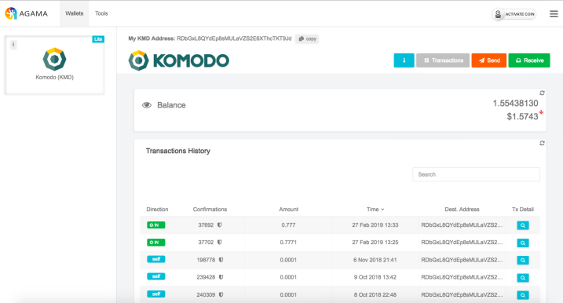

# pbca26 Notary Node Proposal 2020

## Voting Address
Region: **NA**

```
RVktxLT6aHoFc2mHCUHVLXKgvazka3BhZ2
```

<br/>

## About Me
A dedicated and loyal team member of Komodo Platform since 2016. A proud co-developer of Agama multicoin wallet and a blockchain enthusiast. An experienced JavaScript developer with honest and transparent approach in everything I do.

## Contact Details
Discord - pbca26#5430

Keybase - https://keybase.io/pbca26

Github - https://github.com/pbca26

## Projects
### [Trezor KMD integration](https://github.com/trezor/trezor-firmware/pull/354)
Helped to add required changes into Trezor firmware (model One/T) to support Komodo Rewards claiming.

### [Enhanced Komodo hardware wallet rewards claiming web tool](https://pbca26.github.io/hw-kmd-reward-claim)
Improved version of Atomic Labs' KMD rewards claiming hardware wallet web tool. Fixed a number of Ledger related issues. Added KMD claiming support for Trezor owners.

<p align="center">
  
</p>

### [Komodo Electrum wallet](https://github.com/komodoPlatform/electrum-komodo)
The very own Komodo Electrum wallet. Electrum wallet is undoubtedly an industry standard when it comes to cryptocurrency wallets. Soon KMD hodlers will be able to use it on a day to day basis to send coins or claim rewards. It has quite a few great features that include HD wallet support, invoicing, multisignature address support, ability to link and use hardware wallets (Ledger and Trezor) and a number of advanced features such as grained coin control, multisignature co-signers pool.

<p align="center">
  
</p>

### [Agama desktop](https://github.com/komodoPlatform/Agama)
Co-developed multicurrency crypto wallet which combines two modes together native (full node) and SPV (lite mode). Rooted in NXT project Agama served as an inspiration for ZelCore wallet that also supports native and lite modes, and as a code base for VerusCoin wallet. Now Agama desktop supports 30 blockchains, 45 KMD asset chains and hundreds of ERC20 tokens.

<p align="center">
  
</p>

### [Agama mobile](https://github.com/pbca26/agama-mobile)
Developed the first KMD rewards claim capable and dPoW enabled mobile wallet which is also the first wallet to support various KMD asset chains along with dozens of blockchains as well as Ethereum and ERC20 tokens. Several projects adopted certain parts of Agama mobile code. Chameleon wallet and Verus Mobile to name a few.

<p align="center">
  
</p>

### [AtomicExplorer](https://atomicexplorer.com)
Developed a unique Komodo asset chain explorer that allows to check balances and transactions for an address or overview transactions across KMD asset chains. Among other features, AtomicExplorer has a standalone web wallet and KMD rewards calculator where you can see projected rewards breakdown for a specific period of time.

<p align="center">
  
</p>

## Why you should vote for me?
For the upcoming season 4 I would like to put myself forward as a candidate to run for a single node - in NA region. Unfortunately, my node from season 3 is not going to be re-elected. However, I have proved myself being a dedicated and reliable notary node operator. 

The reason to vote for me is that I accomplished most of the points from my 2019 notary election proposal. For instance, I improved hardware wallets support for KMD users, and took over development and support of KMD hardware wallet rewards claiming web tool.

Having a notary node brings me an opportunity to dedicate even more time helping and contributing to various community projects, work on more ways to access and use KMD on hardware wallets.

## Voting Address 
**Region:** NA

```
RVktxLT6aHoFc2mHCUHVLXKgvazka3BhZ2
```

VOTE2020 airdrop is scheduled on March 15th. Tokens will be distributed among all KMD holders in ratio 1:1. To cast a vote you need to send your VOTE2020 tokens to notary candidate address of your choice.

Thank you for your vote and support!

---

### NA Server specifications
- 128 GB RAM
- 2 x 960GB NVME
- 2 Gbps port
- Location: NA
- KMD-address: RMZHMdSAJrGzsKp7xUtLtYizBf9L8eVawZ
- BTC-address: 1DH6H7Ysi2URoKSvVJuDo2PnRPgjUhWy9r
- btcpubkey: 03a97606153d52338bcffd1bf19bb69ef8ce5a7cbdc2dbc3ff4f89d91ea6bbb4dc

### Disclosure
I am a part of the Komodo team