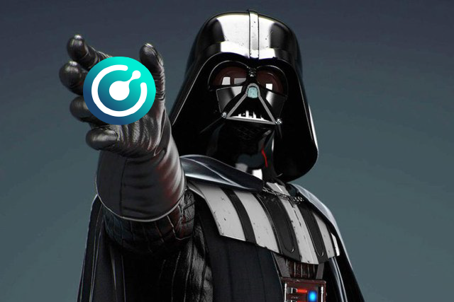
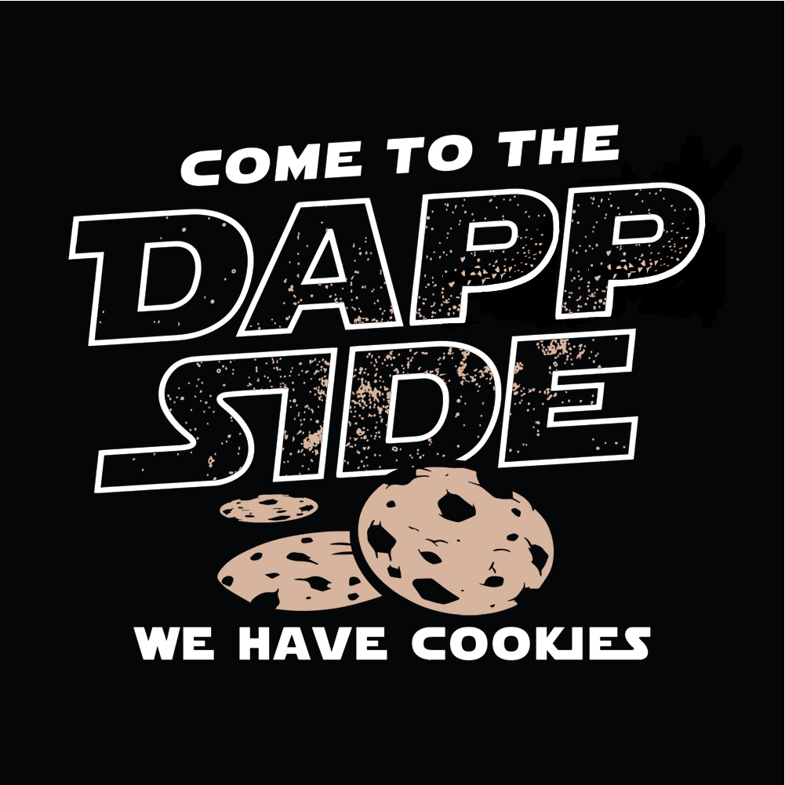

<p align="center">
  
</p>

## Voting Info ##
Region: **EU**

Address:
```
RV6TYQ94Sfv1jcapxDJ11n23nNouutn7wn
```

## About me ##
- <b>Top 3</b> Notary Node operator in Southern Hemisphere region
- 5+ years of experience in server maintenance and operational support
- Blockchain enthusiast, made my very first Bitcoin on Radeon GPU within a couple of months after learning about the technology in late 2013
- Komodo platform admirer and supporter through transferring a portion of my rewards to the CHIPS fund
- Huge fan of Star Wars franchise

After joining the Notary Node network in Season 4 my interest in the community and blockchain technology has been rapidly growing. I definitely expanded my knowledge to become a reliable operator. My main goal is to efficiently maintain a node whilst keeping a high level of productivity and security. With a proven track record of successful node administration, I would be grateful for the opportunity to participate in the upcoming season.

## Mined funds will be used to ##
- Cover hardware costs
- Dedicate time to buidl dapps on Komodo
- Support ecosystem projects where applicable

## Season 4 CHIPS fund donations ##
To date I have already donated <b>817.22 KMD</b> to the CHIPS development fund as was promised in my last year's proposal.

### Q1 ###
281.48 KMD

http://kmd.explorer.dexstats.info/tx/9f0cd5629d49bd6a8939f96c4923e03776a9af16898b840071094c3306e84051

### Q2 ###
219.74 KMD

http://kmd.explorer.dexstats.info/tx/8a5ac8e681481f1dc97f809a104bc2cd7859aaea2e1a2d3c1cb77ce3fe1de9d5

## Q3 ##
316 KMD

http://kmd.explorer.dexstats.info/tx/27280b878966adc97935a2ddc26399c03a166c6756ea0ee0cdd367e18219c922

## Pledges ##

**`10%` quarterly to the CHIPS development fund from both EU and SH nodes.**

## Server specs ##
- CPU: AMD Ryzen Threadripper 2950X
- RAM: DDR4 128GB
- Storage: NVME 2TB x 2
- Network connection: 2 Gbit

## Contact info ##
**Discord:** Dapp Vader#4565

**Keybase:** https://keybase.io/dappvader

Thank you for your support and trust, good luck to all candidates!

<p align="center">
  
</p>
