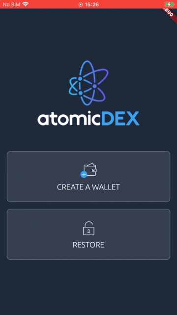
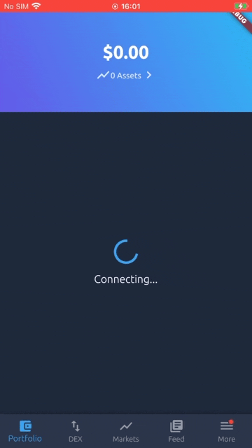

# NN Season 5 Proposal for ***dathbezumniy***

Region AR --> <code>RX2wKLEk6M9qp4tWPft2un9ysnFURA2a3y</code>

 

  
#Preface  
Hi, I've joined Komodo team a year ago as a junior QA engineer, since this was my first tech job, I have to say that previous roles as a Sales or PM didn't prepare me even a tiny bit to join this brilliant-techy team, but you have to start somewhere right? Gladly during those "white collar" years my main hobbies were coding in python which I did for countless hours in a row and ofc mining eth with GPU rigs! Honestly speaking, I dont have anything to brag about in my life before kmd happened so I decided to just tell you a story of my first year at KMD. Trying to cut it as short as possible, hopefully for your amusement or at least for a silent and neurotic laugh at some point =P.  
This is an unnescessary offtop that you can <a name="end">skip</a>, but I feel like even though marketing is always ready to talk to community, our team is mostly closed off in our tasks and duties and does not have the time to properly convey what is going on inside (and I'm not saying its unhealthy, on the opposite it is the way its supposed to be).

#Story.  
I. As a first task at KMD, I've managed to release a very very early alpha version of kmd-sync-api (https://github.com/dathbezumniy/kmd-sync-api) and kmd-sync-bot (https://github.com/dathbezumniy/kmd-sync-bot). Would love your opinion here NNOPs and please let me know if I should enrich/branch those projects out with more functionality for notaries, add security (for example) so this could be run in production... or even something else that you wish nn-tg bot should have.   
II. Next task was to monitor electrums uptime that we use for adex GUIs. Obviously, real monitoring should be done with more sophisticated tools, so this project goal is to simply prove to users that issues they are having atm are not because of electrums downtime. Also it could be a handy tool to check for yourself once in a while when no one is around :) [https://eyelectrumx.herokuapp.com/](https://eyelectrumx.herokuapp.com/).  
III. And then finally the big game arrived ahah!!! [500KMD Bounty for a new Protocol integration](https://github.com/KomodoPlatform/atomicDEX-API/issues/723) into atomicDEX-API! Wow! Can I do it?! probably!!! Now we are ***in the big league*** boiz! :D Deploying Smart Contracts and Reaping the bounties!!!  
IV. Another day, another dollar. Now I'm the _main_ QA on the [QRC20 Swap Integration](https://github.com/KomodoPlatform/atomicDEX-API/pull/735) into atomicDEX-API. Was I scared? hell yeah. Did I read every doc imaginable about QTUM and QRC20? ***most probably***. Did I approve the PR? hell yea, after finding a few crucial bugs ofc. pew pew. xD  
V. Between these two assignments there was a december 2020 stress-test! A big smooth stress-test which I believe all the team deserves credit for, however right before the last mobile gui revision, I've uncovered a certain bug which could've possibly led to "not so smooth stress-test" so to speak. Just speaking the facts, nothing else, may the god of crypto strike me if I lie about that xD  
VI. So... in for a pound, in for a penny. Now I'm the _only_ QA on QRC20 mobile GUI integration (Tony's chilling on vacation, respect, no pun intended btw. ***chilling is also a skill which you must develop working at kmd***) Let me tell you... if a few strategic issues weren't opened that day before release, most of mobile qrc20/qtum users would be spamming #support with a lot of confusion in their hearts!  
VII. Gladly that all got sorted out, big thanks to API team but afterwards one thought was stuck in my and Yurii's head (our mobile team lead), and that thought was... more autotests! ***more autotests!!! MOAR AUTOTEZTZ!!11***  
VIII. The need arises and so... please welcome Sir MOAR AUTOTEZT at your service:  
#Autotests  
     
     
Just a start, but from 0.4.0 onward these tests are going to run on every PR and on every mobile device that I can get my hands on, making sure nothing essential breaks down and you will always be in controll of your dexperience :D  

#Sumitup  
So, an introduction... hehe. "Long story short" Now I'm a junior flutter dev at kmd since last month. For the next year will be bringing you new features on mobile gui front as well as an up-n-coming webdex.  
Please reach out to me if you have any particular expectations from our mobile team, I will make sure your voices are heard from within!  
Or you can just pinch me to find out what I'm working on and what is coming, always glad to share what I can.  

#NNOP  
Now on the subject of NNOP:  
_I solemly swear to provide notary operator service to the best of my ability and knowledge and will never disobey the nn-bible or will go against the common sense (in favor of community) in doing so_.  

#Proposal  
20-30% of the funds from Notary Operations minus expenses would be specifically allocated to winners of hackathons that I will be a part of in Russia: Saint-Petersberg, Moscow, Novosibirsk or Tomsk.  

#Specs  
My main server on testnet is  
* Intel Core i7-8700  
* 2x SSD M.2 NVMe 512 GB   
* 4x RAM 16384 MB DDR4  
* NIC 1 Gbit  
* Location: HEL1  

Its in EU zone atm, but I'm already on the task of securing 2 servers according to the NNOP instructions in AR zone in case I get elected for season 5!  

#End  
Good luck to every candidate in this election and I just hope you didn't find me too tedious in my introductory message which was written just to provide you with some alternative to what you can read on NNOP candidacy and maybe a bit of laughter :D  
***vote 1.12345 if it did make you laugh, it will make me a bit happier xD***  
***gl*** and dont forget to chill and ***hf***  
