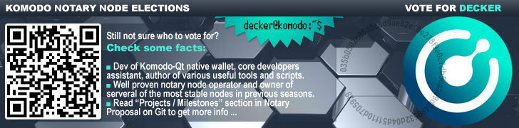

## BIO ##



Decker is a Komodo IT Expert and SysEngineer.

He joined the Komodo team in 2017 and handles a number of tasks relating to the Komodo infrastructure. Some of these include:

- Assisting core developers
- Providing Support for the Testing Team
- Developing new dapps
- Deploying fail-safe work environments (explorers, etc.)

He is one of the Komodo-Qt wallet devs - the world's first GUI wallet for a zero-knowledge fork that supports KMD and all its smart chains. 

Decker has demonstrated knowledge and passion for blockchain, cryptography, programming languages and system administration. He is among the most active Komodo members. 

## Vote4Decker with QR ##

| AR | EU |
| :---: | :---: |
|  |  |
| `RHeRFNk2jih5oFedJpgFXx8wPANv5iiFg7` | `RAE43rkzYV3YQ5QcR3twTtNxEkQb8RNrBf` |

## Projects / Milestones (2020-2021) ###

- [KomodoOcean](https://github.com/DeckerSU/KomodoOcean) - last year Komodo-Qt wallet obtained several highly wanted dev and user features, such as possibility of cross-compilation build for MacOS X from Linux, get rid of using `gcc` as default builder on native Darwin platform with using of default `clang` compiler instead, new .dmg package installer for MacOS ... See *What's new?* section of every build on [releases](https://github.com/DeckerSU/KomodoOcean/releases) page for all changes. Also it has become more fast (in some places even faster than original `komodod`), fail-safe and easy-to-use.

- [dPoW](https://github.com/KomodoPlatform/dPoW) - assisted core developers for `dPoW` integration to 3rd party coins, fixed the source code of notarizer (`iguana`), contributed ideas and code.

- [komodo_scripts](https://github.com/DeckerSU/komodo_scripts) - supported the one of the most useful repoes for NN ops, fixed bugs and added new features to existing scripts.

- Together with other devs participating in `crypto-conditions` (CC) integration into the 3rd party projects sources.

- Developing Verus-Qt native wallet for VRSC:

    

    Sources are not yet public available, bcz it's in the alpha state, but you can download and test Windows binaries from [download page](https://download.kmd.sh/verus/) to test the functionallity.

## Projects / Milestones (2019-2020) ###

- [KomodoOcean](https://github.com/DeckerSU/KomodoOcean) (Komodo-Qt) [2019-2020] - maintained native Qt wallet for KMD and smartchains among whole year: successfully implemented changes needed for HF (Obsidian Dragon) transition, added new features, deleted old / unused code (code refactoring), improved exising features (such as wallet filter and others), fixed CVEs, etc. At the begin of Feb/2020 Komodo-Qt had over **14k** total downloads and this is a great achievement itself.

- [yiimp-stratum-equihash](https://github.com/DeckerSU/yiimp-stratum-equihash) - created world's first public implementation of equihash stratum for well-known Yiimp pool. Also, distinctive feature of this implementation is so called "local mode", which allows stratum binary to work without Yiimp MySQL database. In "local mode" it acts like simple proxy, between miners (equihash stratum protocol) and daemon's `getblocktemplate` and can be used not only with KMD or any other equihash based coin, but also with any other coin daemon supported by Yiimp Stratum in original. Also, project included a special branch for MSVC building, so, it can be used in "local mode" even by Windows users.

- [Komodo](https://github.com/KomodoPlatform/komodo) (KMD) and [Verus](https://veruscoin.io/) (VRSC) - contributed with various fixes and improovements, which allowed Komodo and Verus daemon to be more stable, secured and convienment to use. Assisted other developers in mitigating of few attack vectors, discovered during 2019 year. 

## Projects / Milestones (2018-2019) ###

- [KomodoOcean](https://github.com/KomodoPlatform/KomodoOcean) (Komodo-Qt) [2018-2019] - completed development of the first native Qt wallet for Komodo and Zcash based fork. In 2018 we completed various wallet improvements, added sapling support into it, fixed minor issues and finally made komodo-qt available for all 3 OS (Windows, Linux and MacOS). Komodo-qt now is available on [https://komodoplatform.com/](https://komodoplatform.com/) in [Wallets](https://komodoplatform.com/komodo-wallets/) section.

- [SuperNET](https://github.com/jl777/SuperNET) / Iguana (Improvement of Iguana) [2018-2019] - added support of 2-bytes network prefix coins (like HUSH) in iguana, investigating and fixing various issues, marked as important by notary node operators, adding *sapling* support in dPOW and splitfunds and other related things. Here is a [full list](https://github.com/KomodoPlatform/dPoW/commits?author=DeckerSU) of Decker's contributions to iguana, merged into SuperNET repo branch, used by other notaries.

- [BarterDEX](https://github.com/KomodoPlatform/BarterDEX) / marketmaker (v1.0) [Feb 2019] - fixed a few sapling related issues (tx signing, withdraw method crash with many vouts) in BarterDEX marketmaker 1.0 to make current release work with sapling enabled chains.

- Notary Node Elections Management [2018] - provided technical assistant throughout all stages of the notary node Elections of 2018 (KMD blockchain snapshot creation, airdropping VOTE2018, statistical analysis, results checking, etc.) 

- [Z-NOMP fork](https://github.com/DeckerSU/z-nomp) [Dec 2018] - created a fork of Z-NOMP with support for KMD and sapling enabled assetchains. Recnetly we made few important bugs fixes like preventing the possibility of creating "fake shares" in some cases.

- [komodo-explorers-install](https://github.com/DeckerSU/komodo-explorers-install) [2018-2019] created and maintained a "one-click" explorer install repo for KMD and assetchains to help everyone deploy it quickly and without any issues. The latest iteration of Insight based Komodo explorers running using this repo.

- [CoinBin](https://github.com/DeckerSU/coinbin/tree/komodo) fork for Komodo [2018-2019] - created a fork of awesome OutCast3k's blockchain tools with KMD support. It's already integrated with official Komodo Explorer and allows you to create and sign transactions, addresses in KMD network using Javascript enabled browser only. The most important point was implementing sapling txes support, whichis now done and CoinBin can be used by everybody, for manual tx creation or for learning blockchain related things. Live version of Komodo's CoinBin is available [here](https://deckersu.github.io/coinbin/#home).

- [komodo_scripts](https://github.com/DeckerSU/komodo_scripts) [2018] - created a repo with various helper scripts for new notary node operators. This helped newcomers setup their notary nodes faster and decreased the learning curve to maintain the server. 

- [kmd-qt-wallet](https://github.com/DeckerSU/zec-qt-wallet/tree/komodo) [Jan 2019] -   created a fork of zec-qt-wallet adopted for using with KMD daemon (komodod). It's not a full-node itself, it's just a Qt GUI that interacts with komodo daemon (komodod) via RPC calls.

- [bip44-quick-gen](https://github.com/DeckerSU/bip44-quick-gen) [Nov 2018] - developed the helper tool to import addresses derived from BIP44 mnemonic to komodod or komodo-qt (can be used with Ledger seed, to import your addresses from Ledger Nano into komodo. 

- [WooCommerce-KMD](https://wordpress.org/plugins/komodo-for-woocommerce/) [Nov 2018] - participated in solving some issues during developent of WooCommerce-KMD plugin. 

## Vote information ##

| VOTE2021 Addresses                 | Pubkey                                                             | Region |
| :--------------------------------- |:------------------------------------------------------------------:| :----: |
| `RHeRFNk2jih5oFedJpgFXx8wPANv5iiFg7` | `035b0502c05d5c6d9ae82e18e278f9e0c7db5eaaa9d2499532d04d51f10d705929` | **AR**     |
| `RAE43rkzYV3YQ5QcR3twTtNxEkQb8RNrBf` | `03990f1b18b93df3a36e48fa9763a8c59e63f6c73cfe6bff29fab2d647472ce531` | **EU**     |


## Contact information ##

 - [Komodo Discord](https://komodoplatform.com/discord): [Decker#3767](https://discordapp.com/users/345544724167524352/)
 - E-Mail: deckersu@protonmail.com
 - KeyBase: [https://keybase.io/deckersu](https://keybase.io/deckersu)
```
-----BEGIN PGP PUBLIC KEY BLOCK-----
Version: OpenPGP.js v4.10.8
Comment: https://openpgpjs.org

xsBNBFx8LNsBCACcHGgP8u1KiM0dv1pynpl1o0JJCpA6ZUQHqSBs4FQlN2re
w2c+2THpf2Npt66KN4kp1tu7z7KHNn6SLyGxwRioVYFVXZeICe5GRPzlSBtU
sPtIJo2Dym8DWKxGsSc28sxwjuQTlvkw07U8a95lzow8ixw2qFI0HQtTsS6m
vdneoueldK7WZwU88awSk5wuhvTfw/XYehj9aK++D4ebt7daxNeBjqLmCnmH
y4xYNVSLV2Z57CYinZeFoE/0OsnMsNrPuhMrEmv/tuEfBdm+HBxEwsZ0ZyQf
77sAUq9ePX4iqIiEBqRLv4k9qr7vbNts8dRFKxkH9GipvrGkeqO2yXhBABEB
AAHNMyJkZWNrZXJzdUBwcm90b25tYWlsLmNvbSIgPGRlY2tlcnN1QHByb3Rv
bm1haWwuY29tPsLAdQQQAQgAHwUCXHws2wYLCQcIAwIEFQgKAgMWAgECGQEC
GwMCHgEACgkQtxi0bf9tdP0QcAf9HMez8SfbYf/Aej0J4o99/Ql+VEY69x+O
hRzIV7XcWAiXNEFALI7b5VqL3CCb15u14xLxGmXSA0iaZltXe454vvUVqEts
QCSxLX2GAFCf47U4BA6FoON+DgxuLKT3mB/nA0QJhy4U1Cqh77j7e+L1dgXH
VEI4calKu7n00yxHo9uUhc7agmfYBkP+iHOXaHAqwm+hE7DNGQsTlrcnteZt
Z6gxzmr4CUYhNA0BtpHZCPKZ72+9X/J4cWpfLM46N0suyX/3h6NbvYUG2Sqc
zMGySjdF2VnPvBvXWbsk4uMWthik5JyW5FzgF+cD8JuSqQvTnHFjGYUt40ck
FB1ij4PMh87ATQRcfCzbAQgAlbqWCUHF7P+XYXchIi2Pingnmi23CP0CrhJD
INcJKRC6Ct5rH5DOxs9LiW5qxEj8DX3FlV156eEplL979cOINI/N0YhKDayJ
vPMggiYWsQM4PMVYtrsr0nqzkbKV2HCTgj7/clbeZ4QYrnslOyukvFclGv+L
t4kRfzhnwpx/yBfNruFeupHhcOm+qqi7PZ+0A87O345rS51LW1OpO4JiT2TA
zEeIEwef+KmrW0YEn3n/rfulRLdT8Ch90qY6Xr17EFslwJuGPoUvGz4LDt7A
WbMiTks22gWKrRWAwpNh/hl2+EbyJA6Y/f7NiXAq21YJvJLIoujnytw8Wuqk
P1WqzQARAQABwsBfBBgBCAAJBQJcfCzbAhsMAAoJELcYtG3/bXT9qFgH/09d
7/Wb1/hQMCVF0HsugwWgGcUPeAHg4U0F66PSgzQUtgJJOhmNK4y2GJ7owcBz
9b3bJ/orNFxPwRtpvcz6Lq/PIjfRisexHh8yXdnqi23gS27kTtDDRF8YN0a4
icrEqtTuRDbYRtYKTnAW7YmjD4+cl86SJRt9/Dk+ZSwWZA9KydzfOostSX8d
yvLqO7LfCS5Wc7Qvz4SOj1xSta/q4tlOjDpn4jsTdE6oDt2zrbgJ2xRpK2Wh
vNbcLKg1iTA5c36i1ym7p7sBATZ6pvYiC1YVq61SvMrw3gcKq1E1ZC2pLlay
mMvXPP7+Eb3CKcknFDGv7lKzG61Z+xGobLD2Pfc=
=bBfV
-----END PGP PUBLIC KEY BLOCK-----
```
 

