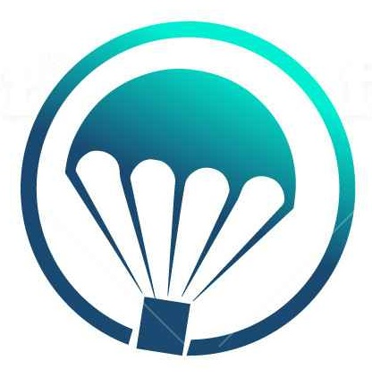
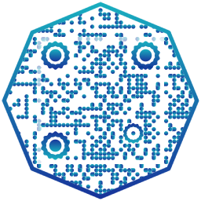

  

Hi!

My name is Hastrup.

I&#39;ve been part of the Komodo community since 2018 and bought my first coins in 2017.
 I have been following the progress of Komodo with great interest and hope to help it flourish in the future.

I have found two other person ( aagaardnisme and Obie1) with the same goals for Komodo and we have formed a small team behind this NN proposal.

 We plan on keeping a third of the profits plus running expenses (Approx. 350USD), the rest will be used to provide fair-trade on Atomicdex, with little too no profit margin. To help make Atomicdex the most desirable exchange platform.

We are going to run with a primary and secondary server setup.
 The server will be based in Denmark, Denmark has one of the world&#39;s most stable electrical infrastructure, with an uptime of 99.99%

**Server spec:**

**Primary server:**

- Xeon CPU 32 cores
- 256Gb RAM
- 10Tb Raid 10 SSD
- 500/500 Internet connection

**Secondary server:**

- Xeon CPU 16 cores
- 128Gb RAM
- 10Tb Raid 10 SSD
- 250/250 Internet connection

We are thankful for your consideration and looking forward to hopefully becoming a NN server and supporting the growth of Komodo.

VOTE 2021 NN Address:

**RR5ML3KMuvMZXkNDeB32DLWvVkkpQyuT32**

  

qr

