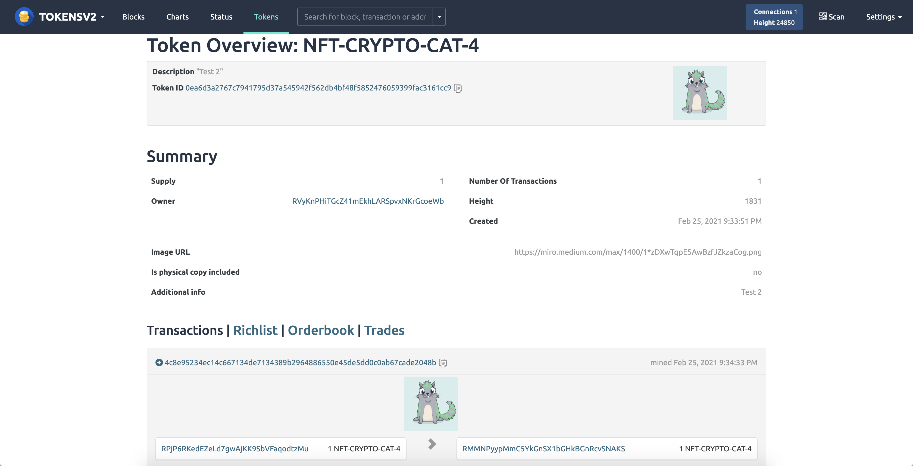
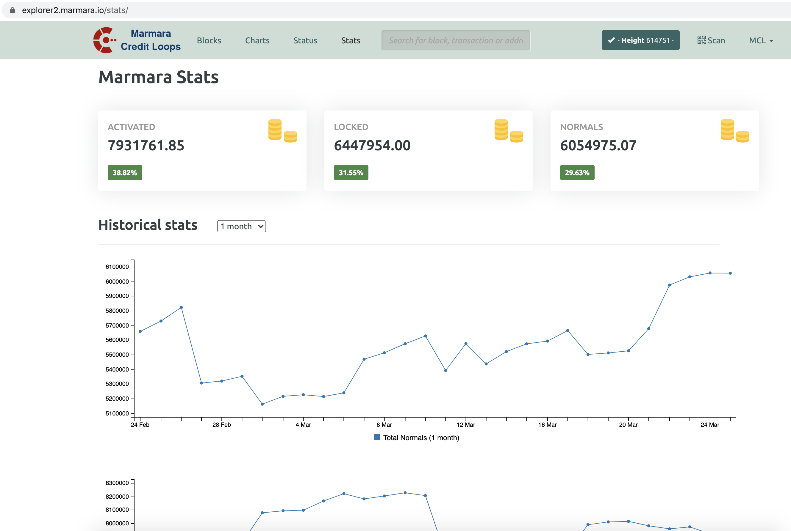
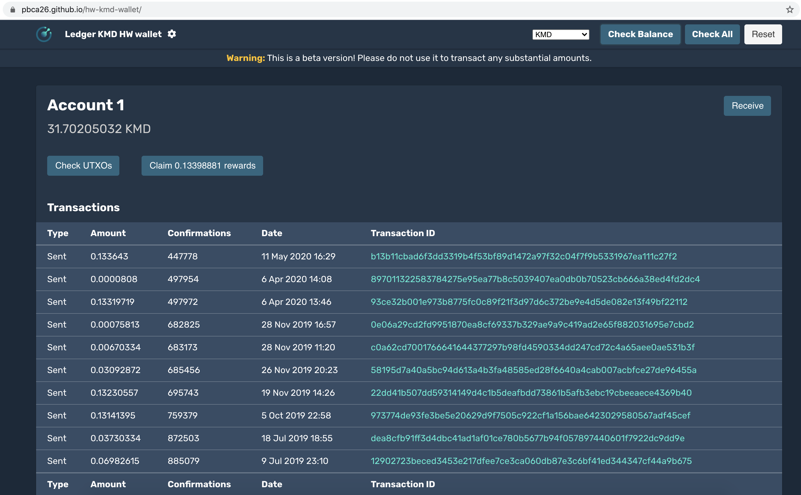
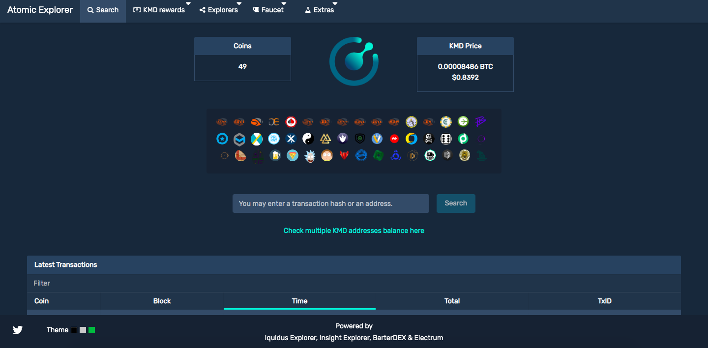
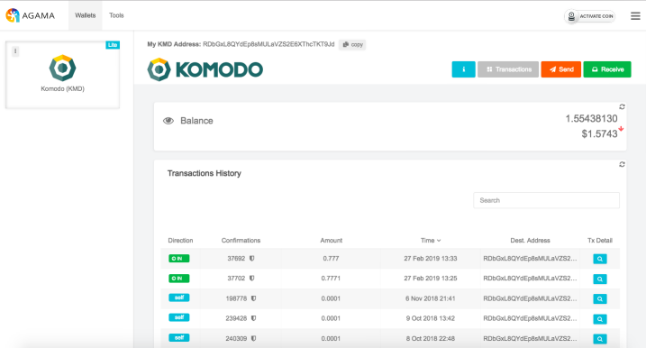

# pbca26 Notary Node Proposal 2021

## Voting Address

Region: **SH**

```
RSTe7FGtdqTksYLKt3iBfSkrGFZkcGW3x6
```

<br/>

Hello! This season I'd like to participate in the election for a node in the Southern Hemisphere region. Below you will find more about me and the projects I've been working on. As always, thank you so much for your time and continued support!

## About Me
A dedicated and blockchain-driven team member of Komodo Platform since 2016. An experienced JavaScript developer with an honest and transparent approach in everything I do. When I got inspired by a challenge, I leverage all my knowledge and leave no stone unturned to transform complex issues into working solutions. Interested in emerging blockchain technologies such as NFT. Top ranking Notary Node operator in NA region for Season 4.

## Reasons to Vote for pbca26
- A reliable and trustworthy operator who believes in decentralization.
- A passionate community member aiming to help Komodo platform growth.
- Highly motivated to dedicate more time developing and contributing to various community initiatives.
- Working on cutting-edge projects such as NFT and tokens.
- Advancing hardware wallet support.

## Projects

### [Insight Explorer Tokens and NFT integration](http://explorer.komodoplatform.com:20000/tokens/TOKENSV2)
Added tokens and NFT transactions support to Insight Explorer. Besides that, I've made an improved version of [SEC wallet](https://github.com/pbca26/sec-wallet/releases) to create tokens and manage token holdings on any available smart chain.

### [Insight Explorer Marmara stats integration](https://explorer2.marmara.io/stats)
Improved version of Insight Explorer with Marmara stats integration.

<table align="center" width="100%">
  <tr>
    <td align="left"><a href="insight-explorer-nft.png"></a></td>
    <td align="right"><a href="mcl-explorer-stats.png"></a>
    </td>
  </tr>
</table>

### [Komodo hardware wallet tool](https://pbca26.github.io/hw-kmd-wallet)
Developed an all-in-one Komodo hardware wallet tool for claiming KMD rewards and managing Komodo smart chains. Ledger and Trezor owners can use it to receive and send funds. Also, I created a [standalone desktop app](https://github.com/pbca26/hw-kmd-wallet/releases) to improve stability and overall user experience.

### [Trezor KMD integration](https://github.com/trezor/trezor-firmware/pull/354)
Helped to add required changes into Trezor firmware (model One/T) to support Komodo Rewards claiming.

### [Komodo Electrum wallet](https://github.com/komodoPlatform/electrum-komodo)
Integrated KMD into Electrum wallet. Electrum wallet is undoubtedly an industry standard when it comes to cryptocurrency wallets. KMD hodlers can use it on a day-to-day basis to send coins or claim rewards. It has quite a few great features that include HD wallet support, invoicing, multisignature address support, the ability to link and use hardware wallets (Ledger and Trezor), and several advanced features such as grained coin control, multisignature co-signers pool. 

<table align="center" width="100%">
  <tr>
    <td align="left"><a href="hw-wallet-tool.png"></a</td>
    <td align="right"><a href="electrum-wallet.png"></a>
    </td>
  </tr>
</table>

### [AtomicExplorer](https://atomicexplorer.com)
Developed a unique Komodo asset chain explorer that allows checking balances and transactions for an address or overview transactions across KMD asset chains. Among other features, AtomicExplorer has a standalone web wallet and KMD rewards calculator where you can see projected rewards breakdown for a specific period.

<p align="center">
  
</p>

### [Agama desktop](https://github.com/komodoPlatform/Agama)
Co-developed multicurrency crypto wallet combined two modes native (full node) and SPV (lite mode). Rooted in the NXT project Agama served as an inspiration for the ZelCore wallet and as a code base for the VerusCoin wallet. Agama desktop supported 30 blockchains, 45 KMD asset chains, and hundreds of ERC20 tokens.

### [Agama mobile](https://github.com/pbca26/agama-mobile)
Developed the first KMD rewards claim capable and dPoW enabled mobile wallet. It was the first wallet to support various KMD asset chains along with dozens of blockchains as well as Ethereum and ERC20 tokens. Several projects adopted certain parts of Agama mobile code e.g. Chameleon wallet and Verus Mobile. 

<table align="center" width="900px">
  <tr>
    <td align="left"><a href="agama-desktop.png"></a</td>
    <td align="right"><a href="https://pbs.twimg.com/media/Dou84MOXkAEdjQE.jpg"></a>
    </td>
  </tr>
</table>

---

## Contact Details
Discord - pbca26#5430

Keybase - https://keybase.io/pbca26

Github - https://github.com/pbca26

### Server Specifications
- 128 GB RAM
- 2 x 960GB NVME
- 2 Gbps port

### S5 pubkeys
#### NA node
Main 0332543ff1287604afd67f63af0aa0b263aef14fe1850b85db16b81462eed834fd

3P   03e8485883eba6d4f2902338ab6aac87654a4b98d3bc01f89638aaf9c37db66ccf

### SH node
Main 02c62877e96fc414f2444edf0601abff9d5d2f9078e49fa867ba5305f3c5b3beb0

3P   021b39173b2b966ab277799a1f148a1d9e6cf26020f5f7eb9708f020ee0461e9c0

### Disclosure
I am a part of the Komodo team
