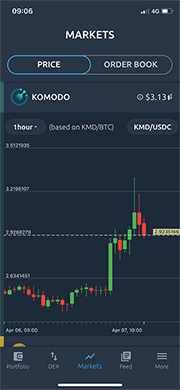
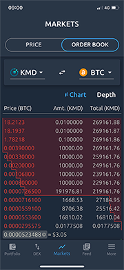
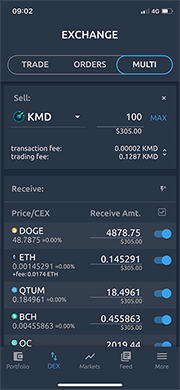

# yurii-khi NN21 Candidacy


## Region
```
EU
```

## Voting address
```
RFKQRyp2Rst9BdozzoqKnsRcUtiWN8cQny
```

## About me

Hey! My name is Yurii, I'm a member of Komodo team since January 2020.
 
Starting July 2020 - Lead mobile dev for atomicDEX mobile app.

My passion and main focus is UI/UX design and engineering.
I hope I've managed to deliver usable and useful UX design solutions for atomicDEX mobile app, as well as atomicDEX web site.

Always trying my best to make user interactions with Komodo products smooth, flawless and enjoyable.

 - 15 years of experience in software development
 - Typescript/react.js fan
 - Flutter/dart enthusiast
 - Passionate angler, happy husband and father, minimalist and zen wonderer

  
 

## Contacts

 - Email: `yuriikhiznichenko@gmail.com`
 - Discord: `yurii-khi#7301`
 - Instagram: `@yurii.khiznichenko`