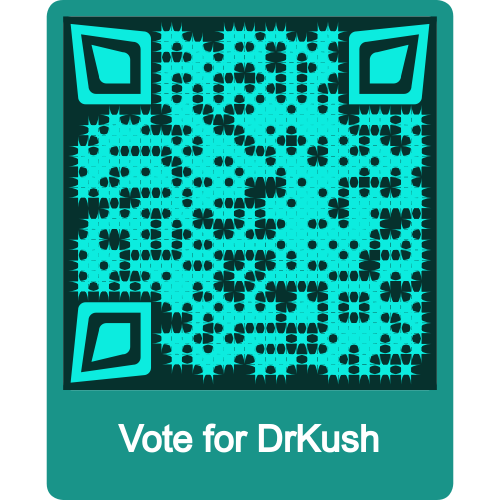
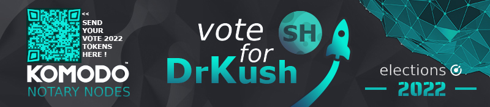
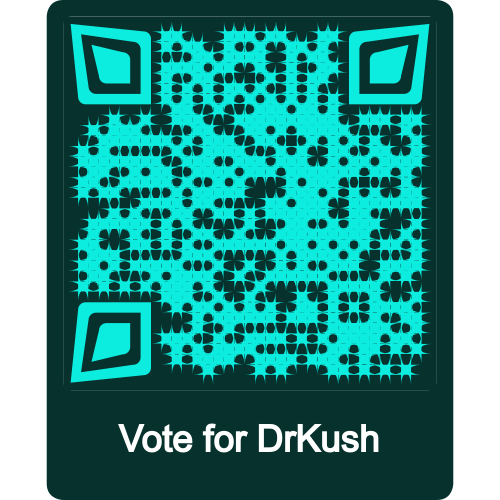
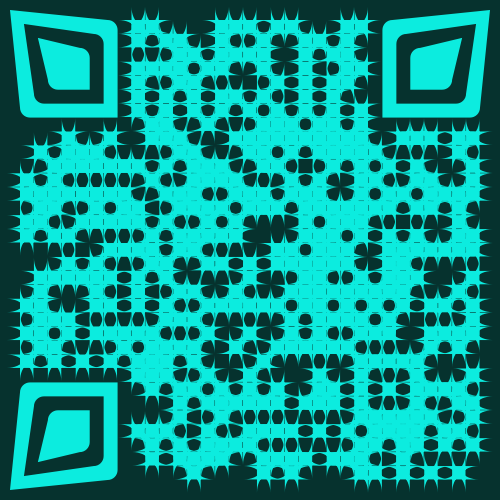

<div align="center">

# DrKush - Candidate for Notary Node 2022

## Region and Voting Address

| VOTE 2022 Addresses                  | Region |
| :-----------------------------------: | :----: |
| `RNnC441veEdv1nD6z6Ty3QtF3Y3XnsrVtc` | **SH** |



``` 
Send your VOTE2022 to my Qr code or my public adress above
```



# Hi the komodo sphere

Indeed I really appreciated this first year as a notary, I think I have evolved in terms of scripting bash and it's very cool !
I am very happy to offer you my candidacy as a notary-node for a 2nd season !
I was ranked in the middle of the table throughout the season which for a first satisfies me, I hope you too :D
I had a lot of fun maintaining everything during this past year.

- https://stats.kmd.io/notary_profile/drkush_SH/?season=Season_5

drkush_SH Main: `030b31cc9528566422e25f3e9b96541ab3626c0dea0e7aa3c0b0bd96039eae2f5a`<br>
drkush_SH 3P: `0210320b03f00f10f16313eb6e8929b5be7e66a034a4e9b7d11f2d87aa92708c6c`<br>

## Who am I ?

I have been a developer very passionate for a few years but currently I have been a web dev teacher for 2 years, being active as a dev in one of the largest French-speaking crypto community in my spare time, I give them little tools such as bots and it would be a good opportunity to talk about komodo ..
I would really like to participate in a real community project to rename such as KMD, now that time allows me !! It would be a real excuse for me to actively join the Komodo community.
Being a big fan of free and open source tools Komodo assetchain is for me a realization of several things that attract me.

Free and Free again !!

## Why vote for me ?

I m very motived and I follow komodo and arrr since 2017, I followed the evolution but lack of time I could not invest myself personally in it, and I see in this election my rebirth in the crypto sphere and particularly around the komodo project - asset -chain that I find is a very good community project.

I am an eternal apprentice and I am always interested in learning new technology, I also see in komodo the possibility of evolving as a developer in order to learn new languages such as RUST and of course to make available my skills as as web developer and teacher to also try to develop komodo within the limits of my skills of course.

I love mentality of JL777 !

## My Project for Komodo-asset-chain ?

If I am elected as a Notary Node it would allow me to free myself a little time that I would of course make available to the Komodo ecosystem, I am a developer and I intend to put my skills at the service of the ecosystem that would allow me to discover even more about the blockchain ecosystem in general this gift I have been passionate about since 2016. I have a short-term project to make DApps with of course the support of komodo, and many others. I would surely make tutorials around its ecosystem !

</div>
<div align = 'left'>

I'm really a fan of the komdo universe and its open-source mindset that is accessible to everyone. I also follow Arrr !

  - https://github.com/xdrkush/tuto-kapp-vue-node (in progress)

(New)

I am currently working on a pwa web architecture project on which we can graft modules and I plan to make open-source modules including services linked to komodo:
   - Key generation
   - Payment
   - ...

I don't know exactly at the moment, but I have to graft a small piece of open-source komodo

Links to demo architecture (in progress)
  - https://github.com/xdrkush/arch-vue3-node-es6

## Server Specifications (Main)
- CPU: Intel Xeon E3-1230v6 - 4c / 8t - 3.5 GHz / 3.9 GHz
- RAM: 64GB DDR4
- SSD: 1TB SSD NVMe

## Promise:

Know that if I am elected as a NotaryNode it will change my life in part, and I promise you that this money left will be used to pay for a house for my family and I promise you that I will do my best for Komodo-asset-chain ! Komodo <3

## Contact:

  - Discord : 𝓓𝓻 𝓚𝓾𝓼𝓱 |🦄| Komodian#3853
  - E-mail  : drkushikush@protonmail.com
  - Github  : https://github.com/xdrkush (I work too in private gitlab)
  
</div>

<div align='center'>

| VOTE 2022 Addresses                  | Region |
| :-----------------------------------: | :----: |
| `RNnC441veEdv1nD6z6Ty3QtF3Y3XnsrVtc` | **SH** |






``` 
Send your VOTE2022 to my Qr code or my public adress above
```

Peace'

</div>
