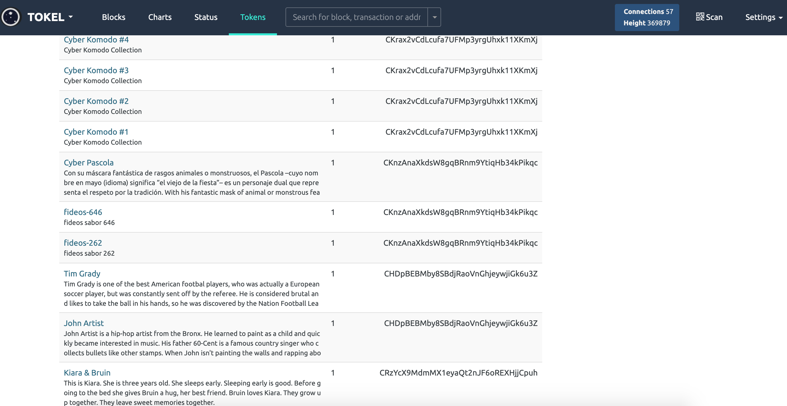
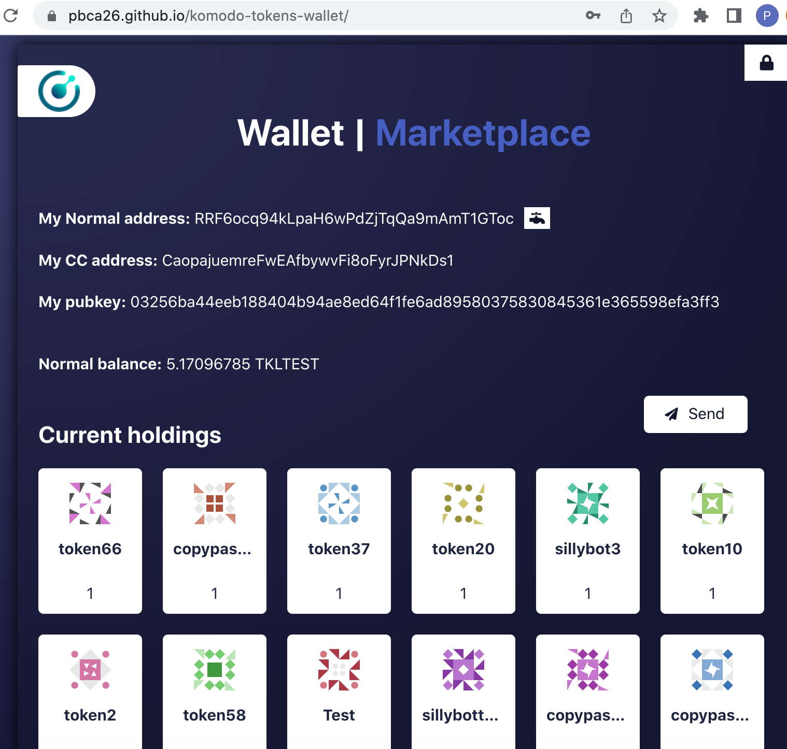

# pbca26 Notary Node Proposal 2022

## Voting Address

Region: **NA**

```
RNe8c9j19FMn567yXxodpb4BnSSsLmik7f
```

Region: **SH**

```
RGZAas7Jj2HwbxUKyQEKYZSSvgTLExYanz
```

<br/>

Hello! This season I would like to participate in the election for a node in North America and Southern Hemisphere regions. Below you may find more about me and the projects I've been working on. As always, thank you so much for your time and continued support!

## About Me
A dedicated team member of Komodo Platform since 2016. An experienced JavaScript developer with an honest and transparent approach in everything I do. When get inspired by a challenge, I leverage all my knowledge and leave no stone unturned to transform complex issues into working solutions. Interested in Hardware Wallets, DeFi and NFT.

## Reasons to Vote for pbca26
- I'm a reliable and trustworthy operator who has been ranked as Top 3 in Season 4 and Top 5 in Season 5.
- A passionate community member aiming to help Komodo Platform growth.
- Working on innvovative projects such as NFT and tokens.
- Constantly contributing to various community initiatives.
- Advancing hardware wallet support.

## Projects

### [Insight Explorer Tokens and NFT integration](http://explorer.komodoplatform.com:20000/tokens/TOKEL)
Added tokens and NFT transactions (aka CryptoConditions) support to Insight Explorer. Currently the explorer can display all types of token transactions as well as provide on-chain DEX activity and quick stats. In addition it has extensive API for wallet/3rd party service developers.

<table align="center" width="100%">
  <tr>
    <td style="text-align: center">
      <a href="http://explorer.komodoplatform.com:20000/tokens/TOKEL"></a>
    </td>
  </tr>
</table>

### [PoC Web Wallet to manage Tokens and NFTs](https://pbca26.github.io/komodo-tokens-wallet/)
This project started as an attempt to build a proof of concept tokens wallet for browsers. The app is capable to create, send tokens, and comes with a few automation features for collection creators and on-chain DEX section.

<table align="center" width="100%">
  <tr>
    <td style="text-align: center">
      <a href="https://pbca26.github.io/komodo-tokens-wallet/"></a>
    </td>
  </tr>
</table>

### [Komodo Hardware Wallet Tool](https://pbca26.github.io/hw-kmd-wallet)
Developed an all-in-one Komodo hardware wallet tool for claiming KMD rewards and managing Komodo smart chains. Ledger and Trezor owners can use it to receive and send funds. Also, I created a [standalone desktop app](https://github.com/pbca26/hw-kmd-wallet/releases) to improve stability and overall user experience.

<table align="center" width="100%">
  <tr>
    <td style="text-align: center">
      <a href="https://pbca26.github.io/komodo-tokens-wallet/"></a>
    </td>
  </tr>
</table>

### [Insight Explorer Marmara stats integration](https://explorer2.marmara.io/stats) | [clickable preview](https://raw.githubusercontent.com/KomodoPlatform/NotaryNodes/master/season5/candidates/pbca26/mcl-explorer-stats.png)
Improved version of Insight Explorer with Marmara stats integration.

### [Insight Explorer Chips played games list integration](http://explorer.komodoplatform.com:20000/gameinfo/CHIPS) | [clickable preview](./chips-explorer.png)
Improved version of Insight Explorer with Chips played games list integration.

### [AtomicExplorer](https://atomicexplorer.com) | [clickable preview](https://raw.githubusercontent.com/KomodoPlatform/NotaryNodes/master/season5/candidates/pbca26/atomicexplorer.png)
Developed a unique Komodo smart chain explorer that allows to check address balance and transactions as well as overview transactions across KMD smart chains. Among other features, AtomicExplorer has KMD rewards calculator where you can see projected rewards breakdown for a specific period.

### [Trezor KMD integration](https://github.com/trezor/trezor-firmware/pull/354)
Helped to add required changes into Trezor firmware (model One/T) to support Komodo Rewards claiming.

### [Komodo Electrum wallet](https://github.com/komodoPlatform/electrum-komodo)
Integrated KMD into Electrum wallet. Electrum wallet is undoubtedly an industry standard when it comes to cryptocurrency wallets. KMD hodlers can use it on a day-to-day basis to send coins or claim rewards. It has quite a few great features that include HD wallet support, invoicing, multisignature address support, the ability to link and use hardware wallets (Ledger and Trezor), and several advanced features such as grained coin control, multisignature co-signers pool.

---

## Contact Details
Discord - pbca26#5430

Keybase - https://keybase.io/pbca26

Github - https://github.com/pbca26

### Server Specifications
- 128 GB RAM
- 2 x 960GB NVME
- 2 Gbps port

### S6 pubkeys
<table>
  <tr>
    <th>Node</th>
    <th>Pubkey</th>
  </tr>
  <tr>
    <td>NA main</td>
    <td>03d8b25536da157d931b159a72c0eeaedb1bf7bb3eb2d02647fa41b2422a2b064e</td>
  </tr>
  <tr>
    <td>NA 3p</td>
    <td>030b6515e80aaa489215875e2aa6f2a15fa36cb3342580e885275f8c636252cbc8</td>
  </tr>
  <tr>
    <td>SH main</td>
    <td>039a55787b742c3725323f0bd81c90a484fbdbf276a16317883bb03eedd9d6aa7c</td>
  </tr>
  <tr>
    <td>SH 3p</td>
    <td>02d17840724692a9d5e72d61d001c31eb5ddc4d2f0f104b760e6854bf144e63fb8</td>
  </tr>
</table>

### Ownership proof

<table>
  <tr>
    <th>Node</th>
    <th>Address</th>
    <th>Message</th>
    <th>Signature</th>
  </tr>
  <tr>
    <td>NA main</td>
    <td>RRQC4QCqmkNZevhYNqPiwxNMkMzkpqnwo5</td>
    <td>pbca26</td>
    <td>IGiGc4zVpsnP2jqdotG5cPkr4PTtpY/G7Efr6UCmZpK+ItuUvony5TsjIfwN3pZPJcLZem3K2VTuiSp8NXVSvwg=</td>
  </tr>
  <tr>
    <td>NA 3p</td>
    <td>RSwDmn938yKatbvr9vVEGbietqzaBwxNKX</td>
    <td>pbca26</td>
    <td>IHEasI9lPNggL+i0eovXSiL+wHh4hXCl7d37mbW4u418HRFSbvc1afFaiM4uBP/TtWaZarGXrdU562lJaRj6gBM=</td>
  </tr>
  <tr>
    <td>SH main</td>
    <td>RQabokWPyG2yzGgmjWPSPhGMn8FSKZ17SY</td>
    <td>pbca26</td>
    <td>H27vLCXY4qEuIGO0NNculjARGQDVibGRW/NxmQVEys9lUb6beDPF9+O49umSCMBnjKoWjuA2oMVW9lsXK6/FAKo=</td>
  </tr>
  <tr>
    <td>SH 3p</td>
    <td>RWLsz8o3g8qkyQyR5Qv9R6dLEPFDD4Ko56</td>
    <td>pbca26</td>
    <td>H/r/+zHtxIfTSvfDXlLrIdYhiaaMm1g9U7zIl9GTbVQ8A3IxX+Oufv0QUWbVjU0ZSv8jjvJieb//fUxmFyb1DqI=</td>
  </tr>
</table>

### Disclosure
I am a part of the Komodo team.
