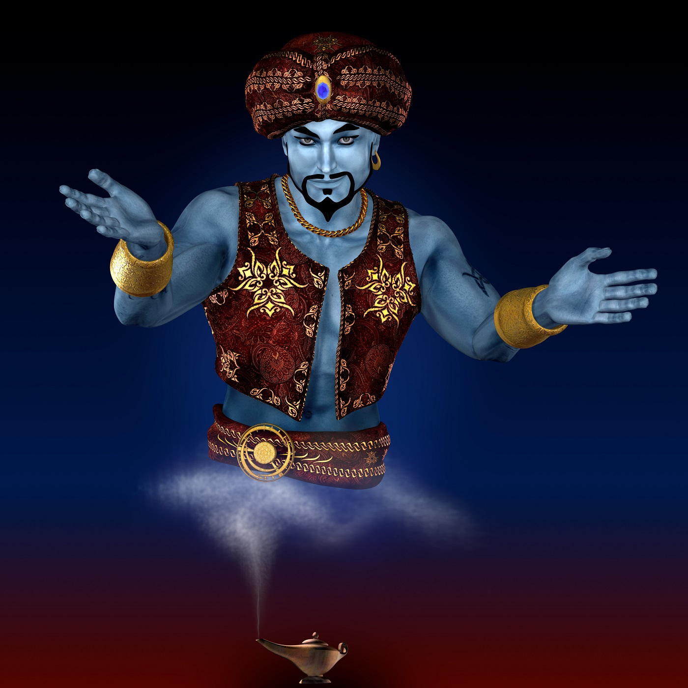

# ComputerGenie Notary Node Proposal  2024

## Who ComputerGenie Is

Throughout my time in the Komodo community I have been seen with equal parts admiration and disdain. Those that like me really like me and those that do not really do not.

Setting my personality aside, it's near impossible for anyone to even attempt to lay the claim that my heart isn't with making Komodo, and the ecosystem
surrounding it, the best technology and currency that it can be. To sum it up in a single word: dedication.

In season 6, I had a Top 3 Notary node in both the EU and NA regions, as well as being the operator of 3 nodes for others resulting in a Top 3 node for each of them in EU, NA, and SH regions.

In season 7, I had a Top 5 Notary node in the EU and NA region, as well as being the operator of 3 nodes for others resulting in a Top 5 node for each of them in EU and SH regions, as well as being the operator of 4 nodes NA region which were more productive than some team member run nodes in that region.

## Address information ##

| VOTE2024 Addresses                 |  Region |
| :--------------------------------- | :----: |
| `RComputerGenieForNotaryNode1yzne3X` | **NA** |
| `RComputerGenieForNotaryNode2wnZhnX` | **NA2** |
| `RComputerGenieForNotaryNode3shsxCp` | **EU** |

## Server specs ##

* OS: Linux
* CPU: A High-Performance CPU
* RAM: 64GB or more
* Disk: 1TB SSD or greater
* Bandwidth: 100Mbps or higher

## Contact information ##

 - Discord: [ComputerGenie#7004](https://discordapp.com/users/474206298427097099/)
 - KeyBase: [computergenie](https://keybase.io/computergenie)
 - Github: [TheComputerGenie](https://github.com/TheComputerGenie)
 - Twitter: [TheComputerGenie](https://twitter.com/RealCompGenie)

### Project Involvement

  - Mining
    - My introduction to Komodo was through mining and I have been actively mining and helping to secure the chain (and many assetchains) ever since.
    - Operator of [chickenpool.com](http://chickenpool.com) a mining pool dedicated to Komodo and assetchains
  - komodod
    - Through chats and testing, several of my theories, commits, and comments have lead to improvements in function and security.
  - BarterDEX GUI
    - testing
    - some development assistance
  - PoS and MGNX
    - active in testing stages of PoS implementation in komodod and became the largest non-dev shareholder of MGNX (the 1st dPoW hybrid PoS/PoW to exist in Komodo)
  - KMDLabs
    - Have been an active tester for LABS and participated as a **LABS NN**
  - PIRATE (ARRR)
    - Started developing the 1st QT wallet internally themed and designed for z-only transactions of PIRATE chain (forked from Decker/Ocean's original KomodoOcean)
    - Created [piratesolo.com](http://piratesolo.com), the only public solo mining pool for z-only PIRATE

[My PGP signature](./mygpg.key)

## Disclaimer
I am **not** running to operate any *official* node of any "project team" (though I do work with/on several projects in the ecosystem including DP and Tokel ); also, I have deep ties to many other NN ops through friendships and projects of mutual interest (of which they may or may not be "team members").
