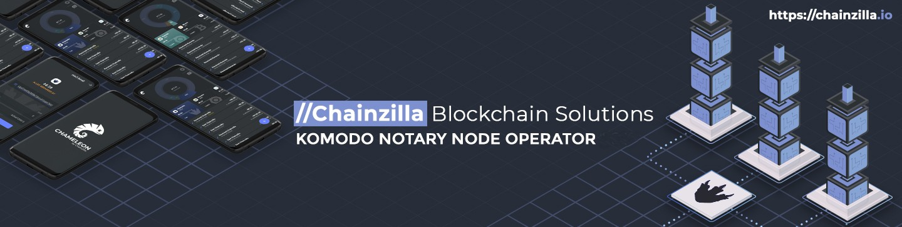

- **IF YOU WANT TO VOTE FOR THE PTYX, SEND YOUR VOTE TOKENS HERE**: 

SH REGION
```
RJ99jW6q1HS6Hb81SVN6QreryCb16ETo42

```

## BIOGRAPHY ##

Charles Gonzalez has been part of the Komodo community since 2016. He's worked as part of the Komodo team in multiple capacities including technical support, management, and business development. Over the past year he's onboarded several projects to Komodo solutions such as smart chains, blockchain security, and Komodo Wallet. 

## Projects / Milestones ###

- [CyberKomodos](https://cyberkomodos.com) / - February 2022 I launched the first generative art collection on Tokel as a proof of concept. The goal is to create the first Komodo-themed NFT collection and build tools that other projects will benefit from on Tokel's ecosystem. Some of these tools include an NFT rarity calculator and a discord escrow bot.  We also helped polish a mass-mint tool to easily mint large collections. 

- [DogeDEX] / - Mar 2021 Reached over 10K installs on iOS and Android. DogeDEX is a branded version of the original AtomicDEX. It's built for the Doge community and it's being used to bridge Komodo's tech with other projects that have a larger user base. 

- [Chameleon Pay] / - Feb 2019 We released the first version of Chameleon Pay - a universal cryptocurrency wallet that was tailored made for Komodo projects. The wallet was inspired by Agama wallet which is developed by the Komodo team. 

- [ChainZilla](https://chainzilla.io) / - June 2018 we launched C.Z. Web Service S.A. as the parent company of Chainzilla.io. The goal is to facilitate blockchain onboarding for Komodo and several platforms. Our team has been successful at launching several projects which range in blockchain creation, app design, and web development. 


## Hardware information ##

- Server #1 (Primary)

    | Spec     | Detail              |
    |----------|---------------------|
    | Platform | [Dedicated Server](https://us.ovhcloud.com/products/servers/game-servers)|
    | CPU      | 2 x [Intel i7-770K - 4ct/8t - 4.2GHz / 4.5GHz](https://ark.intel.com/content/www/us/en/ark/products/97129/intel-core-i7-7700k-processor-8m-cache-up-to-4-50-ghz.html)|
    | RAM      | 4 x 32Gb DDR4 2400MHz Crucial ECC Reg (CT32G4RFD424A) |
    | Storage  | SoftRaid 2x450GB NVMe + 1x4TB SATA |

## Contact information ##

 - [Discord](https://discord.gg/HXjJkB4)
 
 
 ## ChainZilla's Public Key ##
ChainZilla1 main server: RPzvZG4zHXCbfoqf4MvgPL6BkRMLd4vqEB - pubkey: 02ac5e2bc7bd5372395eab76c56951f699af617cd4e1fa2926eb7318e9caecd531
Chainzilla1 3p server: RUwXhVFqHgQqqreaEDc31bwxgPTZEH2BdZ - pubkey: 025d72ef0f1c5103de306d536360bcf3c5b6129c2046334b21cec8202e9bfc4baf

 
 ```-----BEGIN PGP PUBLIC KEY BLOCK-----
Version: Keybase OpenPGP v2.0.77
Comment: https://keybase.io/crypto

xsFNBFuPOWYBEAC+/f2J+vpZl9OqPpCgr71l6/1kL+gA4jKRnr3RQbiIgN6fsY3E
E717bcsS+rZX63osy3QEqXE41Wba65HwRJm0wOXXsCkSanW3q+5LOUtFqWJuqsca
zctC0w2rhJIuzpYfdxLaimwiUUTa6haWRTl+Uj8jHgcz5WB1qGpE43zQAQEV04R2
3lRiNcVVfawqLcxZmX92t5MXB31Od3/RfTZqWPUsPOvxuUNPGokycL6cEj/dkxeg
1UCMVPycNwZDuiCwOkxIDSLR0vHshfyks5g+Dr8ll04xpGJdu31+JX8/jtcdzjKb
YH97ZC9EJkxW3BCUURYRnmps7o1f6Wm9qT87a2ek++0vsyRdzEErCEA4r+rCWizj
4OYjtO9OUXA2v5f25tMp//L4HsUs7bVNih3vc0mubnOlwUUHdMQ72XGKGe50FxbW
P24IjTV+I+/4NUOD2CUffO/NAeQ1lrNhyTfU/rFoNEPiwo7vR6xGnAsd70SLXfax
FICTNtYMn/O5bnfYJs8Y7U1YB8X/9bQQ+M2wXwEZdJyf1vRGT/4P6Y539Jr+eNNh
Q8PPMT/QYJ7leWJbhjTxXWSQvGdyhsbgEqt/cWucG7qaDcnshjJIaXGKo4olz2Au
nidlLgandwlXSEqaaw51qyBOEMMcDVhIjbJ8/AZwHu1ePjfoeQBxmuOc7QARAQAB
zR9DaGFpblppbGxhIDxwdHl4QGNoYWluemlsbGEuaW8+wsF0BBMBCgAeBQJbjzlm
AhsDAwsJBwMVCggCHgECF4ADFgIBAhkBAAoJEEqCWnVeKstW+vYQAIFNnvFyExMq
FtYHREBSigezLOJEOqeFJUPBQ24FW23oXDC7E1qSLDfjfxOWE/JCWOEcPP6/dHxZ
ZxiulT0BhGPzobRXvbmRn+G7/9B4N1ZR8hRD/Pk8wpaYBCmN82/uUxqp2QLfN5L6
YoaCJ6xuhgHhRvmNpq0LqvyMJNTPLE0vTUbEQPvAMuMdl+j7MOqM3Hyh13IlAl2u
XoQFV1jRA13kEcJ4jMa4HNb1Ii3KjQK4xf7DWIffnI2Nh9Fc7M5N0jpyauFfrGVf
zhqpY8bxdLuTpZ5b+TXRaVB1dtmiyEZyEIa4RegLn9k0CcaLnaVpYbvsVpbmyhD+
HNStBows54Fs78mYWN83iBNWIDGg+3pC+hjUjpZFt8rEUYg4aKNi7bWEdC3fnEhq
G9rXNKn0yphnKv6IobTqpXnJxzjVm8fyoZSBtID9RYUQHWik4oxYZbKvtSr30hBc
mXtDq1HQ90a+732DgQykf/JUClmvhXlqdTfooyDQJwwiaE+lLlx3FKGL08CpBy4n
IhTZH2/5byGtt3WzbwN+Kp8wy6S86HWBLmdQ1UEcLmWmMCMCVl1H/qr5aK6Snh8z
RPrutUYd9YJ+aWPw1RtzyV8XHr9teQxjdvFFGGWXesYbFrl1KmMwW4n1Ep1gQZhp
vB/UCtV2XG71viN9Zg7cLKSEbFGOtDNyzSBDaGFpblppbGxhIDxoZWxsb0BjaGFp
bnppbGxhLmlvPsLBcQQTAQoAGwUCW485ZgIbAwMLCQcDFQoIAh4BAheAAxYCAQAK
CRBKglp1XirLVirTEACshNr0/ox3q5cDX+6e4Eg+pJSpI35GXmL+n43mbkcJnlML
CIcU9rN6Dpg2HD+F7470Nm8egkCbw7C2YFgX+VqE2DpMKdQ2NbQ4W5Fk6jfinDCv
WQwhE58MFow8+gzjhmbmCguNAa0QC6KnENpcc/u7uI1N3zO2Hst7YOLmpr/Zx+kg
MlXXvqg/09NPykSMxl8NF7dSzl1svvzO12BijvDRrOe7OhR0MqBzVUWNDnoitVM/
DakeohGd+VL8Fcodg/rJ69Lw2T9CnZl9s6+TrvxkqfoOoW6LENiZPyDPLIXjrNHc
H8syBLLdC3KDhz+sP4eydKiG6NWFIJETcT6A7/YUdN+XvxTDAM9EdWgpsdPlWCFq
N94biCj93a4zFUtMUlKNADtSyBn3Zhi1NQMaIn6fK9RYN5VPwAKwe9hPXtVj4mKr
q0d1FXnDWhNj/JfMCtyF0mklof6mzTj5w/iTi4iO8DCiHucPgi+Zq4A6xQN8IwJ9
1nTc/Gb75+wHk7xKtx/0uZoPk+h7ZveGb8bKBF8w2GrBej9nRwoasj7dUa1Chhzf
U/qzTkR1SXD7Wuv929fHNOLBMLap40KxDTbaQr3snbE20gfUDKpI8Wz8BndPiKZ7
8G8vkJIoMkL0Gnfvry52rz1KLb10ppGj39NH5tSqCtysksGyIIffhKTIYrgiS87A
TQRbjzlmAQgA1A8VLiEx2yRKkm85kDXbhOQwkIFwFeCsLqpqP8ySBjNkqKrb4Lac
HblVSO4q+8h2zxxgfWsgSyvXh2rGCTLSpYhOR13nkBi1oGpLzgHSU7GR4zlR9yS+
hn7HuX4no8eP0WMa8LKcMQe9SBTc+shYKDdp0V3sBdScy6YumveGKN++Q1H9MED+
9+x62vh+Vs7YgC0M8ln0NIvkNTazqz0UZnuuDbeBdvaj7vJEsCZPho1FzQnoVuAE
xZaMVyhK0eS2bdXZt0F4dg1H6sQ6YG3Rtn4BMk7KEf9HV4u1c023JFEiiwWuYh6q
1/1J+lJhMxtDlLpbbfJdL+gF+SIH6MqfjQARAQABwsKEBBgBCgAPBQJbjzlmBQkP
CZwAAhsMASkJEEqCWnVeKstWwF0gBBkBCgAGBQJbjzlmAAoJEC4++bNoUNcIqHUI
AKCZH3DY3KiOxltJyVxsY1wcJoUyJAzBiP1PYBigR5Q6ovH1PYqz2oEZaptT3kJA
ySnl60/AT6kYjQSi5t0iUM2gom4nJDKOEDpi3avvbwayfI0qp+3EFc6rdpc4z+tE
RrPS+TvbrpEAVax8p7pfmIUZQ8eyvzYETRP8yzvGKPNYRgJUWT3zc+dZbQ8mSvtW
hS7POw+6IiPLBt8afEAtZgRI5VjBIRPWKaqdbxf3SV63K6BAwyI89sUaZ3YHCeOE
tJPQNXJP1Gb+pGxzuc3ZSGqL3/NsH68pD4VT5c/AH8hrvPW+zAaAfE3GH52pTgcK
/AnDR+0/W5QOOZKwcABND4rJWw/+K0IXlyxDIGNLQBN5pWAMDBm6481hiR7klerO
5wFmRFiMY86rgIRFdz0SqleoNoX8m37uc3PMrqtDTjd+DvEmr0g4gY0P8rUJBP1Z
5z/6hVlyM6ImJ2nYGDx9VkhTcr3YnDKk+W4JG/p0bqannZnPcVyQ+miO5/D/nhWS
+6Gcw9mZME6JLn0ZzjRPB3P3oHxGiM7bm9AZjP4hE6HtaqJeluNKV6DPn3WOLZ4U
rorPhrGx+p3w1xgaEzQsh+ENZcwB7KmrjzWq7i7SiiL+8SOWwPGzUc4Wh5VD15rn
TFXw3UJ2b7BIH/ak8mKcqJwB+D+4h5IrsQn8ZvxS+aFU6rO7iKyZUHuoU9GdkksA
JtntMLJsvVbDEGzXMbtCNt2zK9nxSMUHphxiiuw/roVK88fFYSXp8EuajuqfSl7z
htdB2/zHKt51wqHJjLF1joqfvoe6zGsKz9aTsgAFkVtX2pFsby6osy0ftKPhxJl+
e36KjZXjs5LRIzBXLoc+mWYRDCauD0eG3OcjJvocjTYD5O56pOtO0eiXqLijjzcJ
sV3KzBLCnhfUtFwofpZWvEHYr1PsMYYWFvwxXsA3WiaZkEIhq/rKRTNSCw1jzouZ
B8cLqb4YI0iWX2MJ/+ggWeA6zuabBEqJg/50Y2pqhkQqcykFG8livCODacK0qt07
YP5Ow7bOwE0EW485ZgEIAM8LIHiqS3sku+6ukInSLGCo1ddLQ7r7eHiQp5VzHJqm
qcaUxSl7E+dT44W9etzv06//b/Z73ELsA450+Agf/sMl8tKB1W0wkURlmMgMTJVo
dmfZNo+Ec3ZXD+hS9SXUi5C+W7JoqoLLGLP+R6g4LS8PvkgvGl5ReUL0wmsl6ISG
RyzqaZ8gdWRABGTmF1FQVHSCEeWjVtiISQyQBoeVmR6ugcx4M4Y71ff+sLTrKSpp
v4xdEww1SGi3bqAa9DgPWo/UrTK7igHEijvg1qXRTLjrcl9OFi+QFyuMq3fhVwXX
upukW8xg5Wqgcc3OyoHYKqy3IgsTm7M6oQYDrsnr8AkAEQEAAcLChAQYAQoADwUC
W485ZgUJDwmcAAIbIgEpCRBKglp1XirLVsBdIAQZAQoABgUCW485ZgAKCRCzv04t
wzPWLpNyB/419CdkVVcrCatbWIuoYk+UFKky2HZzNBA6Hn/fmw6vQvd5yLmD828T
rGZn/tbK9VL1Hq81JD9rm/2X57FFoLgHqEeCu1FSL0UkEmOImTKLPOV3fl7HEHgb
ItEWEZVELJbiVROZAAx99D/lvhdMoNAPxmM6pzarvKGqxnZi5O2t1KIsz3TP67Ds
Q0s+8CPyqiaWPB5S7LiK6N9CDFvX8R0NnrzYteQEz+WGAeiYW3uN1MALKg6lNnYs
4/3+V2Q8nzYkqViuxn4RCp7adLn2ARKJbNtg+6NQ3S/I/im8Y+D+ocU9GnQRDAHb
rI9QscBTKHi3PYfVyycUdb9X0K1QSpayIKsP/jWJut3F9nqlueVUKbJC+Cq2j3Av
vKV2B5o2cnjV1Hra/9ypn+Dr4uhokU76yb+7/zGsMAVyzn0bE5co63ziam1KAZ2w
um3DqCrhmC79OTalMsNfg9BL0pHvLzqA3Cpfbl/7Gb9jRLepfBWeFJLs/d7JHVD7
AgW1DyW8wAWb0KpkA2aCDiv5hX6vzO+cYlm6dyQROhZAarfpGvug6kUEw6uErY1y
DO2AvMsv0PTROFQGYaweBFfoUnE3c3hI95DVRHZy8p9uGlrEv99xQTnR50RC+RLV
AOrxAwsUFlhsmnY4fTz4kTs2Mck4Q+IiumnXA+IuuPb5o/m63iyk/SSljll7tFsb
k8o8B6UOOWQut005BNz8J06jdvT3kT8IOradbVUTugVWN8Qcbyujq4t4FNHkZ8fI
RusqDTNRkOIYY/ua89TMxHcYc+Eo7QK8Brg/tckncxQHN6T6JGnngnqzMBwjkEdC
K8gfamb2tvG5DqQXt8a+zD5Xf4XeDQ7TpGMofEtqNfWjxAd5rSbkzMa2fMOek5wP
jJe7lHx1SVoYLKe7hsgFV66HWDADM5WunJ5Uyn2H1nKifTvD8WphtcxpyjXE+9pr
hh1drWowLjRTWH3tiRqmyeRtcHAgW3+b3jw0oY3oayAAEwwgbBgFHgRgPxVGv5nb
5QbCdejeaF5NWz5Y
=YCHU
-----END PGP PUBLIC KEY BLOCK-----```

